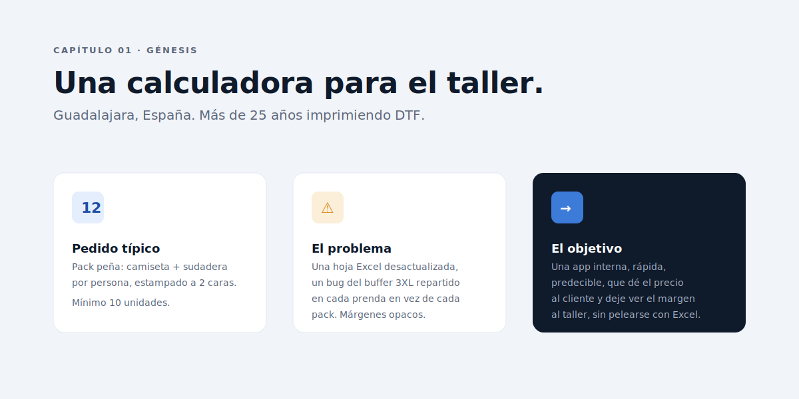

# Capítulo 01 · La idea y el contexto

> Una empresa de personalización textil DTF en Guadalajara con más de 25 años en el sector necesitaba dejar de cotizar packs de peña con una hoja Excel desactualizada. Este capítulo cuenta de dónde venía el problema, qué pesaba en la balanza y por qué la respuesta tenía que ser una app pequeña, lenta de cambiar y rápida de usar.

---

## El taller y el cliente

PackPrice nace para una empresa real. Un taller textil de **Guadalajara, España**, especializado en **DTF (Direct-to-Film)**: la técnica que estampa diseños sobre película de poliéster y los transfiere a la prenda con calor. Camisetas, sudaderas, polos. La mayoría de pedidos son **packs de peña**: grupos de amigos que quieren la misma prenda con un mote, un dibujo o un logo, normalmente para las fiestas patronales del verano.

Tres datos importantes:

- **Más de 25 años** en el sector. No son nuevos. Saben qué pasa con la merma real, con los recargos de tallas grandes, con los plazos.
- **Dos a tres usuarios** internos van a usar la herramienta.
- **Posicionamiento profesional, no low-cost**. El precio importa, pero no es el único argumento. La garantía de reposición ante defectos y el servicio cercano pesan tanto como el ticket.

Eso último es importante porque condiciona todas las decisiones que vienen después: la app no necesita ser bonita para vender, necesita **ser correcta** y **ser rápida**.

---

## La urgencia: la temporada de peñas

Hay un detalle que cambia el cronograma de todo el proyecto: **el grueso de pedidos llega en una ventana de pocos meses**. La temporada de peñas se concentra entre la primavera tardía y el final del verano, cuando se cierran las fiestas patronales. En esos meses se concentran los presupuestos grandes y, también, los descuentos por volumen más interesantes para el cliente.

La beta no se construye para "tenerla lista algún día". Se construye **para que el taller pueda trabajar ya esta temporada**, con la calculadora corrigiendo el bug de la Excel y mostrando los tramos en directo. Cualquier feature que no sirva para presupuestar un pack en julio queda fuera del alcance V2 y entra en el [roadmap](../10-empaquetado-y-futuro/README.md): histórico, PDF, datos del cliente, integraciones. Llegarán, pero después.

Esa restricción de calendario es la que justifica los cinco packs cerrados, el mínimo de 10 unidades, los recargos hardcodeados a 4XL/5XL+. Es lo que un taller de dos usuarios necesita en julio, no lo que querría tener en diciembre. La app está diseñada para **ampliarse en versiones siguientes** con más versatilidad para el cliente: packs personalizables, mezcla libre de modelos, más prendas, datos del cliente, exportación. Hoy entrega lo justo para vender bien la temporada que viene.

---

## Lo que ya había

El problema: una **hoja Excel** y dos documentos Word (hoja de pedido firmable + estudio interno de costes). El Excel calculaba márgenes y tramos. Funcionaba lo justo.

Tenía dos defectos serios:

1. **Bug del buffer 3XL repartido por prenda**. El colchón de 0,40 € que amortiza el recargo de tallas grandes en el mix típico se sumaba a cada prenda, en vez de una sola vez por pack. Resultado: márgenes que parecían ~1 punto porcentual peores de lo real. No era catastrófico, pero distorsionaba las decisiones.
2. **Falta de tramos por volumen consistentes**. El Excel asumía un PVP fijo. La realidad de un taller que negocia con peñas pasa por descuentos por cantidad. Sin esa lógica modelada, cada presupuesto grande era un cálculo a mano.

A eso se sumaban dos problemas operativos:

- Cualquier ajuste de PVP exigía abrir Excel, cambiar números, recordar guardar, reenviar. **No era versionable** ni había rastro de quién había cambiado qué.
- La hoja vivía en el NAS pero **se abría en cliente Excel**. Si dos personas la tenían abierta a la vez, una perdía cambios.

Es la versión textil de un problema clásico: cuando una herramienta crece sobre Excel, llega un momento en que la fricción supera al ahorro.

---

## Lo que se quería

El objetivo de PackPrice se fijó con tres criterios duros y dos blandos:

**Duros** —esto tenía que funcionar sí o sí—:

1. **Calcular el PVP de un pack en menos de diez segundos** desde que llega un cliente con una idea.
2. **Mostrar el margen real al taller** para que ningún descuento se acepte a ciegas.
3. **Poder cambiar parámetros** (PVP, recargos, IVA, MO/hora) **sin tocar código**, sin redespliegue, sin esperar a un developer.

**Blandos** —esto era nice to have pero impactaba mucho—:

1. **Cero infraestructura nueva**. La empresa tiene un NAS. Punto. No hay servidor Linux, no hay cuenta de cloud, no hay equipo de IT.
2. **Cero curva de aprendizaje**. El usuario abre el `.exe`, ve la pantalla de packs, hace clic, escribe la cantidad y obtiene el precio.

De ese cuadro nacieron casi todas las decisiones técnicas que vienen después. Todas las negativas (no React, no SQLite, no backend) se entienden solo si se entiende esto.

---

## El sector como restricción

DTF tiene tres particularidades que el modelo de costes tuvo que digerir desde el día uno:

- **Coste por metro lineal de película + tinta**. No por prenda directa. Una prenda a 2 caras consume ~0,40 m. Una a 1 cara, ~0,20 m. El consumo dispara el coste mucho más que el modelo de prenda.
- **Mano de obra dominante**. El taller mide el tiempo en minutos por prenda. Cinco minutos para 2 caras, tres para 1 cara. A 15 €/hora de tasa imputada, eso son 1,25 € de coste laboral por camiseta a 2 caras. El equivalente a la mitad del precio de la prenda Roly cruda.
- **Reducción real por volumen**. Más prendas iguales = menos cambios de plancha, mejor nesting de la película, menos fallos. Para el taller esto se traduce en una reducción del tiempo medio del 10 al 20 % según el tramo. Esa reducción tiene que verse en el PVP del cliente, o el taller no captura el ahorro.

PackPrice traduce esos tres efectos en parámetros editables del config. El [Capítulo 02](../02-modelo-de-negocio/README.md) los desmenuza uno por uno.

---

## Por qué una app y no una web

La pregunta natural era: _¿no basta con una web interna?_ La respuesta es no, y tiene tres razones acumuladas:

1. **El navegador no escribe filesystem arbitrario**. Una web no puede guardar el `config.js` modificado en el NAS. Tendría que ofrecer descarga y pedir al usuario que lo suba. En un taller sin equipo IT, eso es fricción suficiente para que la herramienta caiga en desuso al tercer mes.
2. **`file://` rompe parte del API web**. Service workers, IndexedDB con cuotas, fetch a otros archivos locales: todo limitado o roto. Habría que abrir el navegador con flags raros.
3. **No hay servidor**. Levantar un Node con HTTP en un PC del taller existía como opción, pero exige que ese PC esté siempre encendido y aumenta superficie de mantenimiento.

Una **app de escritorio Electron** evita los tres problemas: tiene Node detrás, escribe filesystem, no necesita servidor. La UI sigue siendo HTML/CSS/JS, así que el código del prototipo web V1 se reutiliza al 100 %. El [Capítulo 03](../03-decisiones-tecnicas/README.md) analiza con detalle los caminos que se descartaron antes de aterrizar aquí.

---

## Decisiones bloqueadas en este capítulo

- **App de escritorio, no web**. La razón principal es la escritura directa al NAS y la independencia del navegador.
- **Idioma del dominio: español**. El cliente y los usuarios hablan español. Variables, comentarios, UI: todo en español. Internacionalización aplazada hasta que haya una segunda empresa que la pida.
- **Dos a tres usuarios como techo del diseño actual**. Si crece, se replantea (V5, centralización con backend). No se sobre-diseña para diez usuarios hipotéticos.
- **Alcance acotado para la temporada de peñas**. La beta entrega lo necesario para presupuestar ya, no la app definitiva. Más versatilidad para cliente y usuario llega en versiones siguientes.
- **Foco en correctitud y latencia, no en rasgos diferenciales**. La app no compite con nadie. Es una herramienta interna. La belleza viene después de la fiabilidad.

---

➡ Sigue por [Capítulo 02 · El modelo de negocio](../02-modelo-de-negocio/README.md).
