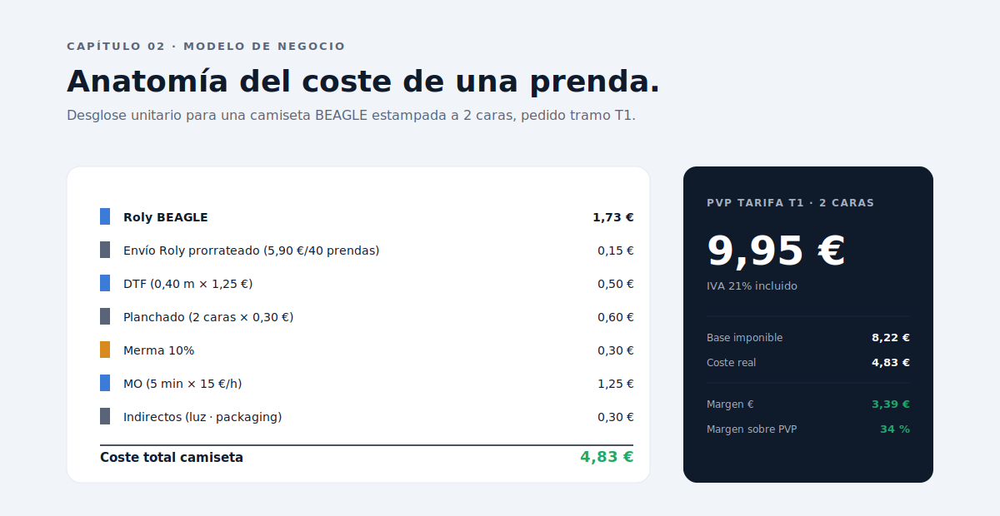
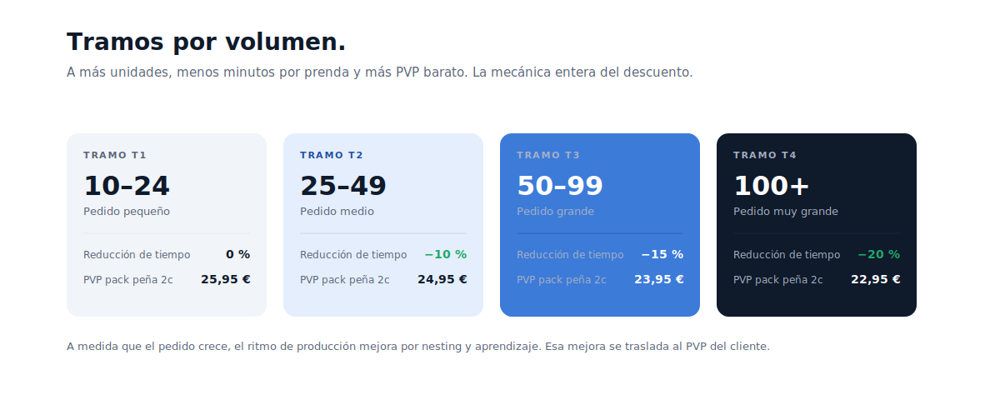
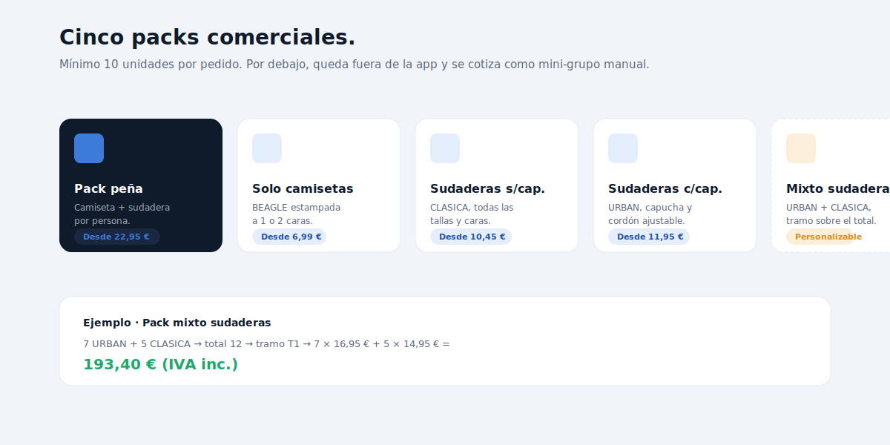

# Capítulo 02 · El modelo de negocio

> Antes de la primera línea de código, el modelo. Si la lógica de costes está mal, ningún componente bonito la salva. Este capítulo desmonta cómo se calcula el coste real de una prenda DTF, cómo se traduce en cinco packs comerciales, y por qué los tramos por volumen son la pieza más sensible del cuadro.



---

## La fórmula maestra

PackPrice resuelve la misma ecuación una y otra vez. Para cualquier prenda terminada del taller:

```
coste_prenda = base_roly
             + envio_prorrateado
             + dtf
             + planchado
             + merma
             + mano_obra
             + indirectos
```

Cada sumando responde a una pregunta concreta del taller. Vistos por separado:

- **`base_roly`** — el precio crudo del proveedor textil (Roly). Tres modelos en uso:

  | Modelo  | Referencia   | Precio | Uso                  |
  | ------- | ------------ | ------ | -------------------- |
  | BEAGLE  | CA65540558   | 1,73 € | Camiseta básica      |
  | CLASICA | SU10700558   | 6,25 € | Sudadera sin capucha |
  | URBAN   | SU1067050258 | 7,88 € | Sudadera con capucha |

  Son precios sin recargo por talla. Las tallas 3XL+ tienen recargo en Roly que se amortiza con el **buffer 3XL** (0,40 €/pack peña) y los recargos directos al cliente.

- **`envio_prorrateado`** — el envío de Roly cuesta 5,90 €/bulto y un bulto cabe ~40 prendas. La fórmula es `ceil(prendas/40) × 5,90 / prendas`. Para 12 prendas, eso son 0,49 € por prenda; para 80, baja a 0,15 €.

- **`dtf`** — película + tinta. 1,25 € el metro lineal. Una prenda a 2 caras consume 0,40 m, una a 1 cara 0,20 m. Es la pieza más volátil porque depende del diseño del cliente; los valores aquí son medios calibrados con histórico.

- **`planchado`** — 0,30 € por cara estampada. Cubre electricidad y desgaste de la plancha térmica.

- **`merma`** — 10 % del subtotal de los anteriores. Cubre prendas mal estampadas, película desperdiciada, errores humanos. Es un parámetro **provisional**: la app está preparada para registrar la merma real durante los primeros pedidos y ajustar.

- **`mano_obra`** — `(minutos × (1 − reducción_tramo) / 60) × 15 €/hora`. La tasa de 15 € no es sueldo: es coste imputado interno (sueldo + Seguridad Social + parte proporcional de luz y mantenimiento, prorrateado por hora productiva). El tiempo base es 5 min para 2 caras, 3 min para 1 cara.

- **`indirectos`** — 0,30 € fijos. Luz general, packaging, etiqueta, tiempo administrativo no productivo prorrateado.

Sumado todo, una camiseta BEAGLE estampada a 2 caras en T1 sale a unos **4,83 €** de coste real. Su PVP T1 es **9,95 €** con IVA. La ilustración del capítulo desmenuza cada euro.

---

## Los tramos por volumen



A medida que el pedido crece, el ritmo de producción mejora por dos efectos: **mejor nesting** de la película DTF (menos sobrante entre diseños) y **aprendizaje** sobre la máquina (menos cambios de configuración). Esa mejora se traduce en una **reducción del tiempo medio por prenda** que se aplica directamente sobre el coste laboral.

| Tramo | Rango     | Reducción tiempo | PVP pack peña 2c |
| ----- | --------- | ---------------- | ---------------- |
| T1    | 10–24 uds | 0 %              | 25,95 €          |
| T2    | 25–49 uds | −10 %            | 24,95 €          |
| T3    | 50–99 uds | −15 %            | 23,95 €          |
| T4    | 100+ uds  | −20 %            | 22,95 €          |

**Por debajo de 10 unidades**, el pedido queda **fuera de la app**: se cotiza manualmente como "mini-grupo" con precios más altos para compensar el coste fijo de gestión. Esa es una decisión comercial deliberada, no una limitación técnica.

La regla de tramo se aplica de forma distinta según el pack:

- En **pack peña**, el tramo se calcula sobre número de packs.
- En **packs individuales** (solo camisetas, solo sudaderas), sobre número de prendas.
- En **pack mixto sudaderas**, sobre la suma de URBAN + CLASICA.

Esa última regla es importante porque genera un descuento natural. Un cliente que pide 7 URBAN + 5 CLASICA está en tramo T1, pero porque suma 12, no porque cada subtipo llegue a 10. La app lo entiende.

---

## Los cinco packs comerciales



PackPrice ofrece cinco modalidades, todas con **mínimo 10 unidades**:

1. **Pack peña completa** — camiseta + sudadera por persona. Es el producto estrella. El cliente elige tipo de sudadera (CLASICA o URBAN) y caras estampadas (1 o 2). La regla operativa: 1 cara siempre vale 3 € menos que 2 caras.

2. **Solo camisetas** — BEAGLE estampada a 1 o 2 caras. Es el pack de entrada barato. Útil para grupos que ya tienen sudaderas o que solo quieren el merchandising estival.

3. **Solo sudaderas sin capucha** — CLASICA. Apropiado para entornos profesionales o eventos de invierno donde la capucha estorba.

4. **Solo sudaderas con capucha** — URBAN. La opción más demandada en otoño/invierno por peñas.

5. **Pack mixto sudaderas** — combina X URBAN + Y CLASICA con tramo calculado sobre el total. Cada sudadera se factura a su PVP individual del tramo correspondiente. El ejemplo del capítulo: **7 URBAN + 5 CLASICA → tramo T1 → 7 × 16,95 € + 5 × 14,95 € = 193,40 € (IVA inc.)**.

---

## Recargos al cliente vs. amortización interna

Una decisión sutil que distingue PackPrice de calculadoras genéricas: **no todos los costes extra se trasladan al cliente**.

- El **buffer 3XL+** (0,40 €/pack peña) es **interno**. Cubre el sobrecoste medio que tiene el taller cuando el mix de tallas incluye 3XL. El cliente no lo ve. Si el mix real sube por encima del 25 % de tallas grandes, hay que subir el buffer en config; el PVP no cambia.
- El **recargo 4XL** (+3 €/prenda) y **5XL+** (+5 €/prenda) sí son **directos al cliente**. Aparecen en el desglose, suman al subtotal, generan IVA repercutido. El usuario los introduce en la pantalla de datos y los ve aplicarse en el resultado.

La razón es comercial: 3XL es relativamente común; 4XL y 5XL+ son excepcionales y los costes de Roly se disparan lo suficiente como para que tenga sentido cobrarlos aparte y dejar la regla explícita en la hoja de pedido firmada.

---

## El IVA y la tesorería

PackPrice trata el IVA como un **pase**: el coste interno **no incluye** el IVA soportado en compras (Roly, DTF, envío). Ese IVA se deduce trimestralmente en el modelo 303 contra el IVA repercutido al cliente. No es coste, es flujo.

La app sí refleja el efecto **tesorería**: pagas Roly con IVA antes de cobrar al cliente. El saldo entre IVA soportado y repercutido determina cuánto líquido se mueve, pero no afecta el margen del pedido.

---

## Lo que está calibrado y lo que no

El modelo de costes está vivo. Algunos parámetros son sólidos; otros son **provisionales** y se afinan con datos reales:

| Parámetro                | Estado      | Acción                                          |
| ------------------------ | ----------- | ----------------------------------------------- |
| Envío Roly 5,90 €/bulto  | Confirmado  | —                                               |
| IVA 21 %                 | Confirmado  | —                                               |
| MO 15 €/h imputada       | Provisional | Contrastar con coste real del autónomo          |
| Tiempo 5 min/prenda 2c   | Provisional | Cronometrar 3 pedidos, si supera 5,5 ajustar    |
| Merma 10 %               | Provisional | Registrar prendas perdidas en 3 pedidos         |
| DTF 0,40 m por prenda 2c | Provisional | Medir consumo real                              |
| Buffer 3XL 0,40 €/pack   | Provisional | Si tallas 3XL+ superan 25 % del mix             |
| **PVP packs nuevos**     | Provisional | Validar todos los tramos antes de uso comercial |

Los PVP de los packs nuevos (camisetas, CLASICA, URBAN, mixto) son **la pieza más débil del modelo actual**. Hay que validarlos con un par de pedidos reales antes de comunicarlos en flyer o web.

---

## Decisiones bloqueadas en este capítulo

- **El buffer 3XL+ se aplica una sola vez por pack**, no por prenda. Es la corrección del bug de la Excel V0.
- **Los recargos 4XL y 5XL+ son directos al cliente y aparecen en factura**.
- **Los tramos se calculan sobre la unidad relevante del pack** (packs, prendas o suma de sudaderas en el mixto), no sobre un único concepto global.
- **Mínimo 10 unidades** en todos los packs. Por debajo no es modelable: cotización manual.
- **El IVA se trata como pase**: no se incluye como coste interno, solo aparece en el total al cliente y en el desglose tesorero.

---

⬅ [Capítulo 01](../01-genesis-y-contexto/README.md) · ➡ [Capítulo 03 · Decisiones técnicas](../03-decisiones-tecnicas/README.md)
