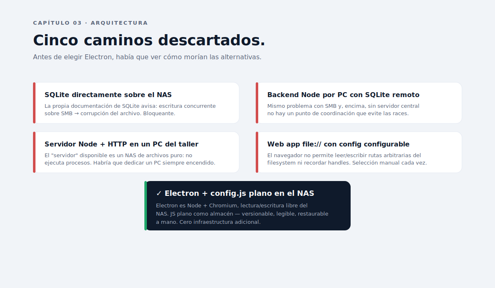

# Capítulo 03 · Decisiones técnicas

> Antes de elegir el camino correcto había que ver cómo morían las alternativas. Cinco arquitecturas se evaluaron y se descartaron una a una. Este capítulo documenta cada una con la razón concreta del descarte, y por qué Electron acabó siendo la opción menos sorprendente.

---

## El problema bien planteado

Antes de comparar opciones, conviene fijar las restricciones reales:

1. **Punto de verdad compartido entre 2-3 PCs** del mismo taller. No es escala "empresa", pero tampoco es local.
2. **Solo NAS de archivos** disponible. No hay servidor que ejecute aplicaciones, no hay PC siempre encendido dedicado a esto.
3. **Sin internet público**. La app no llama a APIs externas, no envía telemetría, no autentica contra servicios de terceros.
4. **Cero infraestructura nueva**. La empresa no quiere mantener servidores, contenedores, ni cuentas de cloud.
5. **Configuración editable sin código**. Cambiar un PVP no debe requerir un developer.

Toda alternativa se evaluó contra estas cinco restricciones. Tres caen sin pelea por la 2; otras dos por la 1.

---

## Caminos descartados

### 1. SQLite directamente en el NAS compartido (SMB)

Era la primera opción "obvia": una base de datos por archivo, ningún servidor, escritura concurrente con bloqueos a nivel de fichero.

**Por qué no funciona** — la propia documentación de SQLite advierte explícitamente sobre **escritura concurrente sobre SMB**: el sistema de bloqueos de SMB no preserva la semántica de bloqueos POSIX que SQLite asume. El resultado documentado es **corrupción del archivo**. No "fallo del que escribe segundo", sino corrupción silenciosa.

Era un **bloqueante absoluto**. Ni con un solo escritor a la vez merecía la pena el riesgo: la próxima vez que alguien abriera dos instancias por error, el config se rompía sin aviso.

### 2. Backend Node por PC con SQLite remoto compartido

Variante del anterior: cada PC ejecuta un proceso Node, todos apuntan al mismo SQLite del NAS.

**Por qué no funciona** — mismo problema con SMB y, encima, sin servidor central no hay un punto de coordinación que evite las races. Habría hecho falta inventar un sistema de locks por encima del filesystem, y eso es exactamente lo que SQLite intenta hacer y falla en SMB.

### 3. Servidor Node + HTTP en un PC del taller

Levantar un proceso Node en uno de los PCs como servidor, el resto se conectan por HTTP. SQLite local en ese servidor. Endpoints REST.

**Por qué no funciona** — ese PC tendría que estar **siempre encendido**. Tendría que tener IP fija o DNS local. Tendría que haber alguien que lo reinicie cuando falle. Tendría que tener firewall configurado. Mantenimiento real, no cero.

Más sutil: si ese PC se rompe, el taller no factura. Una calculadora interna no debería ser un punto único de fallo de esa magnitud.

### 4. Web app `file://` con ruta de config configurable

Abrir la app HTML en doble clic desde el explorador, pedirle al navegador que escriba al NAS.

**Por qué no funciona** — el navegador, por seguridad, **no permite escribir rutas arbitrarias del filesystem desde `file://`**. La File System Access API existe pero requiere permisos explícitos por sesión y no recuerda handles entre arranques. Forzaba selección manual del archivo cada vez que se abría la app. Para 2-3 usuarios usándola varias veces al día, eso es un robo permanente de atención.

Existió una **V1 web** funcional con esa fricción incorporada. Sirvió como prototipo visual y de lógica, pero no como producto.

### 5. SQLite en V1 con un solo escritor centralizado

Compromiso intermedio: usar SQLite, pero garantizar que solo una instancia escribe a la vez (semáforo a nivel de aplicación).

**Por qué no funciona** — técnicamente viable, pero **sobredimensionado para un fichero de configuración**. El config son ~80 KB de JS plano con cuatro modelos, cuatro tramos y cinco packs. Meter una BD relacional para guardar ese diccionario es una sobreabstracción que suma complejidad sin valor.

Y peor: una BD binaria es **menos legible y restaurable** que un archivo de texto. Si el NAS se corrompe, restaurar un `.sqlite` requiere herramientas; restaurar un `.js` se hace con notepad.

---

## La decisión: Electron + `config.js` plano

La opción que sobrevivió al filtro es la menos sorprendente:

**Una app de escritorio Electron** que cada PC tiene en local, leyendo y escribiendo un único `config.js` centralizado en el NAS.

Razones, en orden de peso:

1. **Electron es Node + Chromium**. El proceso principal puede leer y escribir el filesystem real, incluyendo rutas UNC del NAS, sin pelearse con sandboxes de navegador.
2. **JavaScript plano como almacén** — versionable con git si hace falta, legible con cualquier editor, restaurable a mano. Exactamente la propiedad que SQLite no tiene.
3. **Detección de conflictos por `mtime + sha256`**. Comparas estado del archivo antes de abrir el editor admin y antes de escribir. Si cambió, dialogas con el usuario. Cubre el caso de dos editores admin simultáneos sin reinventar la rueda. El [Capítulo 09](../09-modo-admin-conflictos/README.md) lo desarrolla.
4. **Backups automáticos antes de cada escritura**, en `<NAS>\Packs\backups\`. Una migración fallida se recupera con `cp`.
5. **UX de app de escritorio nativa**: diálogos Windows, "Explorar...", iconos en la barra de tareas. Encaja con la mentalidad del usuario del taller: "abro el programa, hago clic, se cierra el programa".
6. **El código del prototipo web V1 se reutiliza al 100 %**. Toda la lógica de cálculo es JavaScript puro y se monta tal cual en el renderer del Electron.
7. **No requiere infraestructura adicional**. Ni servidor, ni BD, ni cuenta de servicio. La empresa sigue sin equipo IT y la app no lo introduce.

---

## El stack final

- **Electron 31** — proceso principal Node.js + renderer Chromium.
- **Node.js fs** — acceso filesystem al NAS.
- **`vm.runInNewContext`** — sandbox para parsear el `config.js` con timeout 1 s. **Nunca** `eval`, `new Function` o `require` dinámico de paths del usuario.
- **`crypto.createHash('sha256')`** — hash del archivo para detección de conflictos.
- **HTML + CSS + JavaScript vanilla** en el renderer. Sin React, sin Vue, sin TypeScript, sin bundler.
- **`config.js`** (JavaScript plano) como almacén de datos. Asignación a `window.PACKPRICE_CONFIG` desde el sandbox.
- **`electron-builder`** para empaquetar el `.exe` portable Windows x64.

Cero dependencias de runtime. Solo `electron` y `electron-builder` como `devDependencies`. Esa restricción no es estética: es una promesa de que el `npm audit` de mañana no genera trabajo.

---

## Decisiones bloqueadas en este capítulo

- **No SQLite** mientras el almacén compartido sea un NAS de archivos. Si el día que se monte un servidor real cambia el panorama, se reabre.
- **No frameworks UI**. La app es lo bastante pequeña como para que React/Vue añadan más coste que valor. Tres páginas, no SPA.
- **No TypeScript**. Mismo razonamiento. Si el equipo crece a 3+ devs o si se introduce un bug que un tipo habría prevenido, se reabre.
- **`config.js` en JavaScript plano, no JSON**. JS permite comentarios y cálculos derivados, valiosos en el archivo del NAS. El sandbox `vm` lo hace seguro.
- **Cero dependencias de runtime**. Cualquier nueva entrada en `dependencies` (no `devDependencies`) requiere justificación documentada.

---

⬅ [Capítulo 02](../02-modelo-de-negocio/README.md) · ➡ [Capítulo 04 · Arquitectura Electron](../04-arquitectura-electron/README.md)
