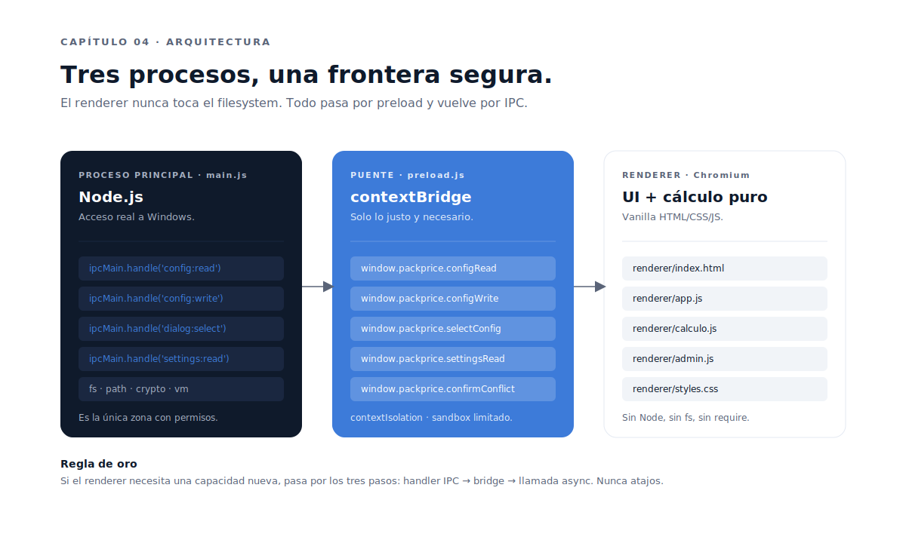

# Capítulo 04 · Arquitectura Electron

> Electron tiene un modelo de seguridad serio si lo respetas: tres procesos, una frontera estricta, comunicación tipada por convención. Este capítulo documenta cómo se separan responsabilidades en PackPrice y por qué cada llamada del renderer al filesystem hace tres saltos.



---

## Tres procesos, tres responsabilidades

Una app Electron bien hecha vive en tres procesos lógicos:

### 1. Proceso principal — `main.js`

Es el proceso Node.js que arranca primero. Tiene **acceso real** a todo: filesystem, diálogos del sistema operativo, ventanas, menús, IPC. **Es la única zona del código con permisos**.

Lo que hace `main.js` en PackPrice:

- Crea la ventana principal (`BrowserWindow`) con flags de seguridad estrictos.
- Carga `renderer/index.html` localmente.
- Registra **handlers IPC** (`ipcMain.handle`) que el renderer puede invocar.
- Lee y escribe el filesystem: `settings.json` en `%APPDATA%\packprice\`, `config.js` en el NAS.
- Calcula hashes SHA-256 para detección de conflictos.
- Crea backups antes de cada escritura admin.
- Abre diálogos nativos de Windows (`dialog.showOpenDialog`, `dialog.showMessageBox`).

### 2. Puente — `preload.js`

Es un script que se ejecuta **antes** del renderer, en un contexto especial: tiene acceso a las APIs de Electron (`ipcRenderer`) pero **se aísla del renderer real** mediante `contextIsolation`.

Su función única: **exponer una API mínima y tipada por convención** al renderer, vía `contextBridge`.

```js
contextBridge.exposeInMainWorld('packprice', {
  configRead:        ()         => ipcRenderer.invoke('config:read'),
  configWrite:       (data)     => ipcRenderer.invoke('config:write', data),
  selectConfig:      ()         => ipcRenderer.invoke('dialog:select-config'),
  settingsRead:      ()         => ipcRenderer.invoke('settings:read'),
  settingsWrite:     (settings) => ipcRenderer.invoke('settings:write', settings),
  confirmConflict:   (info)     => ipcRenderer.invoke('dialog:confirmar-conflicto', info),
  // ...
});
```

Cada función expuesta es una **superficie de ataque potencial**. Por eso `preload.js` expone **solo lo justo y necesario**, no `ipcRenderer` entero ni `fs` directo.

### 3. Renderer — `renderer/`

Es Chromium. Aquí vive la UI: HTML, CSS, JavaScript vanilla. **Nunca** habla con `fs`, `path`, `crypto` o `vm` directamente. Solo a través de `window.packprice.*`.

Estructura:

- `index.html` — una sola página con todas las pantallas; cada sección se muestra/oculta con la clase `.hidden`.
- `app.js` — orquesta eventos de UI, transiciones entre pantallas, llamadas IPC.
- `calculo.js` — funciones puras de cálculo: `calcularCostePrenda`, `calcularPackPena`, `calcularPackMixto`, `getTramo`. **Reciben `cfg` por parámetro**, no leen estado global. Son testeables sin DOM.
- `admin.js` — UI del modo administrador.
- `format.js` — utilidades de formato (`fmtMoney`, `fmtPercent`).
- `styles.css` — todos los estilos, incluido el sistema de tokens.

---

## Configuración de seguridad

Las flags de la ventana son la primera línea de defensa:

```js
const win = new BrowserWindow({
  width: 1280,
  height: 800,
  webPreferences: {
    preload: path.join(__dirname, 'preload.js'),
    contextIsolation: true,        // renderer aislado de Node
    nodeIntegration: false,        // sin require/process en renderer
    sandbox: false,                // necesario porque preload usa require
  },
});
```

A nivel de HTML, la **CSP** (Content Security Policy) es restrictiva:

```html
<meta http-equiv="Content-Security-Policy" content="default-src 'self'">
```

`'self'` = solo recursos servidos desde el propio paquete. Sin scripts inline, sin CDNs, sin trackers. Si un atacante consigue inyectar `<script>` en el config (improbable), el navegador no lo carga.

| Invariante | Por qué |
|---|---|
| `contextIsolation: true` | Aísla el renderer del proceso main |
| `nodeIntegration: false` | El renderer no puede llamar a Node directamente |
| `sandbox: false` | Necesario porque `preload.js` usa `require`. Si refactorizas, ponlo a `true` |
| CSP `default-src 'self'` | Bloquea scripts/recursos externos |
| `vm.runInNewContext` con timeout 1s | El `config.js` se parsea aislado del filesystem |

---

## El patrón IPC: tres saltos para una operación

Cada vez que el renderer necesita el filesystem, el flujo es este:

```
[renderer/app.js]  await window.packprice.configRead()
       │
       ▼
[preload.js]       contextBridge.exposeInMainWorld → ipcRenderer.invoke('config:read')
       │
       ▼
[main.js]          ipcMain.handle('config:read', async () => {
                     const ruta = await leerSettings();
                     return await leerConfigDesdeArchivo(ruta);
                   })
       │
       ▼
[Node fs]          fs.readFileSync(...) + vm.runInNewContext(...)
```

Tres saltos. **Asíncronos**. Cualquier excepción en `main.js` se serializa como `{ ok: false, error: e.message }` y vuelve al renderer, que la muestra con `mostrarError({ titulo, mensaje, detalle })` — un diálogo nativo de Windows, no un `alert()` JS.

### Convención de nombres IPC

Todo channel sigue `<recurso>:<accion>` en kebab-case. Ejemplos válidos:

- `config:read`, `config:write`, `config:create-default`
- `dialog:select-config`, `dialog:confirmar-conflicto`
- `settings:read`, `settings:write`

Esa convención no es estética. Hace que añadir un canal nuevo siga un patrón mental único:

1. Añadir handler en `main.js` con `ipcMain.handle('<recurso>:<accion>', ...)`.
2. Exponerlo en `preload.js` como `nombreAmigable: () => ipcRenderer.invoke('<recurso>:<accion>', ...)`.
3. Llamarlo desde el renderer con `await window.packprice.nombreAmigable(...)`.

Si te saltas un paso, el renderer recibe `undefined` y la app se queja. Bug obvio. Bien.

---

## El cálculo es una isla

Hay una decisión de arquitectura que merece su propio párrafo: **`calculo.js` no depende del DOM ni del IPC**.

Las funciones de cálculo son **funciones puras**: reciben datos, devuelven datos. No leen `document.querySelector`, no llaman a `window.packprice`, no tocan `localStorage`. Solo:

```js
function calcularPackPena({ cantidad, tipo_sudadera, caras, recargo_4xl, recargo_5xl }, cfg) {
  const tramo = getTramo(cantidad, cfg.tramos);
  const pvp = cfg.packs.pena_completa.pvp[tramo.id][tipo_sudadera][caras];
  const subtotal = cantidad * pvp;
  const recargos = (recargo_4xl * cfg.parametros.recargo_4xl)
                 + (recargo_5xl * cfg.parametros.recargo_5xl_plus);
  return { tramo, pvp, subtotal, recargos, total: subtotal + recargos };
}
```

Esa pureza tiene tres consecuencias buenas:

1. **Se testean sin tooling**. `vitest`/`jest` con un fixture `cfg` y a correr.
2. **Se reutilizan**. La misma función alimenta el "preview en vivo" lateral (cada `input` recalcula) y el resultado final.
3. **Se entienden**. El que las lee no necesita seguir el flujo completo del renderer; entiende qué entra y qué sale.

---

## Errores: fail-fast en main, mensajes claros en renderer

Las dos zonas tienen estilos opuestos de manejo de errores:

- **En `main.js`**: si una operación falla, lanza `Error` con mensaje en español. El handler IPC lo captura y devuelve `{ ok: false, error: e.message }`.
- **En el renderer**: cualquier respuesta con `ok: false` se muestra al usuario con `mostrarError({ titulo, mensaje, detalle })` — diálogo nativo Windows. **Nunca se silencia un error**.

Hay una excepción documentada: **`crearBackup` en `main.js` no es bloqueante**. Si el backup falla (NAS lento, permisos), se loguea pero no detiene la escritura del config. La razón: bloquear una escritura porque el backup no se pudo hacer es perder el cambio del usuario por un problema secundario. Mejor escribir y dejar rastro de que el backup falló.

Esa decisión está documentada en `CLAUDE.md` §4.5. Cualquier otra excepción al patrón fail-fast tendría que documentarse igual.

---

## Decisiones bloqueadas en este capítulo

- **`contextIsolation: true` y `nodeIntegration: false` no son negociables**. Cualquier feature que parezca exigir lo contrario, se replantea.
- **`preload.js` expone funciones específicas**, no namespaces enteros. Cada nueva función es una superficie de ataque y se justifica.
- **CSP `default-src 'self'`**. No se introducen scripts inline, no se cargan recursos externos. Si un día se quiere CDN, primero ese debate.
- **El renderer no toca filesystem ni Node**. Si lo necesita, va por IPC. Sin atajos.
- **`calculo.js` no depende de DOM ni de IPC**. Recibe `cfg` por parámetro. Es la pieza más testeable y reutilizable de la app.
- **Errores explícitos**: nada de `try/catch` vacíos. Solo se silencia con razón documentada.

---

⬅ [Capítulo 03](../03-decisiones-tecnicas/README.md) · ➡ [Capítulo 05 · `config.js` y persistencia](../05-config-js-y-persistencia/README.md)
