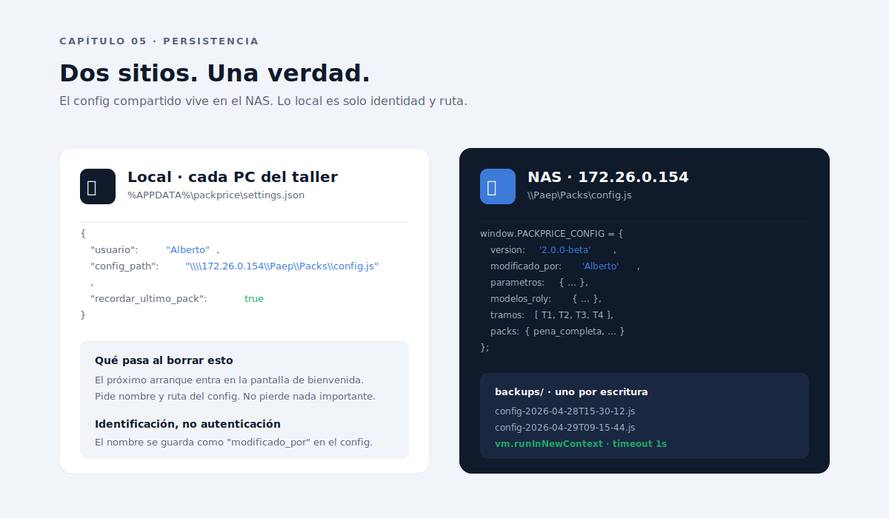

# Capítulo 05 · `config.js` y persistencia

> En PackPrice, los datos viven en dos sitios y solo dos. El `config.js` del NAS es la verdad de negocio: PVP, tramos, parámetros, modelos. El `settings.json` local es identidad y ruta. Ningún dato del cliente se guarda en ningún lado todavía: la app calcula y olvida. Este capítulo explica el porqué.



---

## Por qué `config.js` y no JSON

Es la pregunta más común y la respuesta más sutil del proyecto.

JSON es el formato natural para "diccionario serializado". Pero PackPrice elige **JavaScript plano** por tres razones:

1. **Permite comentarios**. Un humano que abre `config.js` con notepad encuentra `// PVP packs T1, IVA incluido` arriba de cada bloque. Eso vale oro cuando el archivo lo edita alguien que no es developer.

2. **Permite valores derivados**. Aunque hoy todos los valores son literales, mañana se podría escribir `merma: 0.10, // 10%` o, si hace falta, expresiones. JSON no.

3. **Encaja con el sandbox `vm`**. Leer JSON exigiría un parser; leer JS requiere ejecutarlo en sandbox aislado. La diferencia en seguridad es nula con `vm.runInNewContext` y timeout 1 s; la diferencia en flexibilidad es notable.

El precio que se paga: hay que ejecutar el archivo, no solo parsearlo. Eso se hace en sandbox con timeout, sin acceso a `require`, `process` ni `global`. Si alguien pone un `while(true)` en el config, el timeout corta a 1 segundo.

---

## Esquema del config

El esquema esperado es:

```js
window.PACKPRICE_CONFIG = {
  version: '2.0.0-beta',
  fecha_actualizacion: '28/4/2026, 15:32:10',
  modificado_por: 'Alberto',

  admin: {
    clave: '...'
  },

  parametros: {
    mo_eur_hora: 15,
    iva: 0.21,
    merma_pct: 0.10,
    dtf_eur_metro: 1.25,
    planchado_eur_cara: 0.30,
    indirectos_eur_prenda: 0.30,
    envio_roly_eur_bulto: 5.90,
    envio_roly_prendas_bulto: 40,
    buffer_3xl_eur_pack: 0.40,
    recargo_4xl: 3,
    recargo_5xl_plus: 5,
    tiempo_2c_min: 5,
    tiempo_1c_min: 3,
  },

  modelos_roly: {
    BEAGLE:  { nombre: 'Camiseta',          ref: 'CA65540558',   precio: 1.7325 },
    CLASICA: { nombre: 'Sudadera s/cap.',   ref: 'SU10700558',   precio: 6.2475 },
    URBAN:   { nombre: 'Sudadera c/cap.',   ref: 'SU1067050258', precio: 7.8750 },
  },

  tramos: [
    { id: 'T1', etiqueta: 'Pedido pequeño',     desde: 10,  hasta:  24, reduccion_tiempo: 0.00 },
    { id: 'T2', etiqueta: 'Pedido medio',       desde: 25,  hasta:  49, reduccion_tiempo: 0.10 },
    { id: 'T3', etiqueta: 'Pedido grande',      desde: 50,  hasta:  99, reduccion_tiempo: 0.15 },
    { id: 'T4', etiqueta: 'Pedido muy grande',  desde: 100, hasta:9999, reduccion_tiempo: 0.20 },
  ],

  packs: {
    pena_completa:    { /* ... */ },
    solo_camisetas:   { /* ... */ },
    solo_sudaderas_clasica: { /* ... */ },
    solo_sudaderas_urban:   { /* ... */ },
    sudaderas_mixto:  { /* ... */ },
  }
};
```

`config.default.js` documenta cada campo y se usa **solo** para sembrar un `config.js` ausente (primer arranque). Una vez creado, el código nunca vuelve a mirar a `config.default.js`.

**Corolario importante**: no se introducen valores numéricos del dominio en `main.js`, `preload.js`, `app.js` o `index.html`. Si hace falta uno nuevo, se añade a `config.default.js` y se lee desde `CFG`.

---

## Lectura segura: `vm.runInNewContext`

El `config.js` se lee así:

```js
const vm = require('node:vm');

function leerConfigDesdeArchivo(ruta) {
  const codigo = fs.readFileSync(ruta, 'utf8');
  const sandbox = { window: {} };
  vm.createContext(sandbox);
  vm.runInContext(codigo, sandbox, { timeout: 1000 });
  if (!sandbox.window.PACKPRICE_CONFIG) {
    throw new Error('El archivo no asigna window.PACKPRICE_CONFIG.');
  }
  return sandbox.window.PACKPRICE_CONFIG;
}
```

Tres protecciones acumuladas:

1. **`runInContext`** ejecuta en un contexto V8 separado. El código del config no ve `require`, `process`, `Buffer`, `global` ni nada del proceso main.
2. **`timeout: 1000`** mata la ejecución a 1 segundo. Bloquea bombas como `while(true)`.
3. **Validación posterior**: si el archivo no asigna `window.PACKPRICE_CONFIG`, lanza error en español. El renderer lo muestra con `mostrarError`.

**Nunca** se usa `eval`, `new Function`, ni `require` dinámico para parsear un config externo. Esas tres APIs no están limitadas y romperían el modelo de seguridad.

---

## Settings local: identidad y ruta

El segundo almacén es **`%APPDATA%\packprice\settings.json`**. Es texto plano, JSON puro, una sola responsabilidad: **decirle a la app quién es el usuario y dónde está el config**.

```json
{
  "usuario": "Alberto",
  "config_path": "\\\\172.26.0.154\\Paep\\Packs\\config.js",
  "recordar_ultimo_pack": true
}
```

Decisiones detrás:

- **Por usuario por PC, no global**. `%APPDATA%` es por cuenta de Windows. Si Alberto y Fede comparten PC, cada uno tendría su `settings.json`. En la práctica es un PC = un usuario.
- **No es secreto**. El nombre y la ruta no son sensibles. No hay tokens, no hay credenciales.
- **Borrarlo es seguro**. El próximo arranque entra en pantalla de bienvenida. La app no pierde nada importante: solo vuelve a preguntar.
- **No se sincroniza con el NAS**. Cada PC tiene su settings. Si Alberto cambia de PC, vuelve a escribir su nombre.

La función del nombre de usuario en el settings es **identificación, no autenticación**. Cuando alguien guarda el config en modo admin, su nombre queda en `modificado_por` para que el resto sepa quién tocó qué.

---

## La ruta del config: UNC vs. unidad mapeada

Una decisión operativa pequeña pero importante: la ruta recomendada es **UNC**, no unidad mapeada.

- ✅ `\\172.26.0.154\Paep\Packs\config.js`
- ❌ `Z:\Paep\Packs\config.js`

Razón: la letra de unidad depende de cómo cada PC mapee el NAS. Si Alberto tiene `Z:` y Fede tiene `Y:`, el mismo config no funciona en ambos. La UNC es independiente del mapeo.

La ruta se valida al cambiarla (mediante el diálogo nativo "Explorar..."), pero la app no impone UNC. El usuario puede meter la ruta que quiera; la pantalla de error es clara si no se puede leer.

---

## Backups automáticos

Antes de cualquier escritura del config, **`crearBackup` copia el archivo actual** a `<NAS>\Packs\backups\config-<timestamp>.js`. Política:

- Se crea **siempre**, incluso si la escritura falla después.
- **No es bloqueante**: si el backup falla (NAS lento, permisos puntuales), se loguea y la escritura continúa. Bloquear la escritura por un backup fallido sería perder el cambio del usuario por un problema secundario.
- **No se purgan automáticamente**. Política sugerida: el operador borra manualmente backups > 90 días una vez al trimestre.
- **No hay limite de tamaño**. Cada backup pesa ~80 KB; 1000 backups son 80 MB. Coste irrelevante en el NAS.

Bonus operativo: copiar `config.js` actual + `backups/` a un disco externo cada 6 meses como protección frente a fallo del NAS.

---

## Migraciones de esquema

Cuando el esquema cambie de manera incompatible:

1. Bumpar `VERSION` en `config.default.js`.
2. Crear una función `migrarConfig(config)` en `main.js` que detecte la versión vieja y la actualice **antes** de devolverla al renderer.
3. Añadir campos con defaults es seguro; renombrar/eliminar requiere migrar y dejar backup.
4. Documentar el cambio en `PLAN_Calculadora.md` sección "Historial de decisiones".

El sistema ya hace backup automático de cada escritura, así que una migración fallida es recuperable. Pero la regla de oro: **hacer la migración idempotente** (ejecutarla dos veces produce el mismo resultado).

---

## Lo que no se persiste

Hoy PackPrice **no guarda presupuestos**. Calcula y olvida. Esa es una decisión deliberada para la beta:

- Los presupuestos son datos del cliente. Guardarlos exige decidir dónde (NAS o local), cuánto tiempo y con qué política de privacidad.
- Sin presupuestos guardados, la app no maneja datos personales. Eso simplifica todo: GDPR, copia, retención, exportación.
- La V3 introducirá histórico (ver [Capítulo 10](../10-empaquetado-y-futuro/README.md)). Probablemente en `localStorage` o JSON local por PC, **no en el NAS**. El config compartido es solo configuración, no histórico.

---

## Decisiones bloqueadas en este capítulo

- **`config.js` (JS plano), no JSON**. Comentarios y futuro de expresiones derivadas pesan más que la simplicidad de un parser.
- **Lectura solo con `vm.runInNewContext` + timeout 1 s**. Nunca `eval`, `new Function`, `require` dinámico.
- **Punto único de verdad de negocio = `config.js` del NAS**. No hay segundo almacén con datos de PVP.
- **`settings.json` solo guarda identidad y ruta**. No se mete configuración compartida ahí.
- **Backups automáticos antes de cada escritura**. Política de purga manual, no automática.
- **No se persisten presupuestos en V2**. La app calcula y olvida. V3 lo introducirá en local, no en NAS.

---

⬅ [Capítulo 04](../04-arquitectura-electron/README.md) · ➡ [Capítulo 06 · Sistema de diseño](../06-sistema-de-diseno/README.md)
