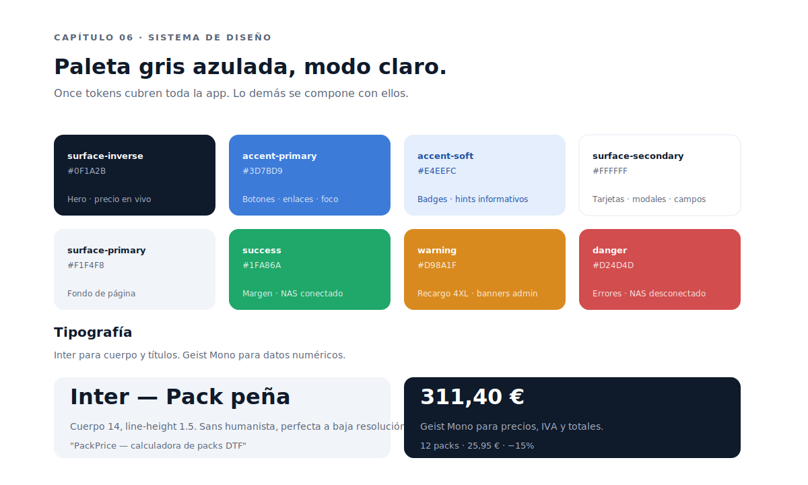
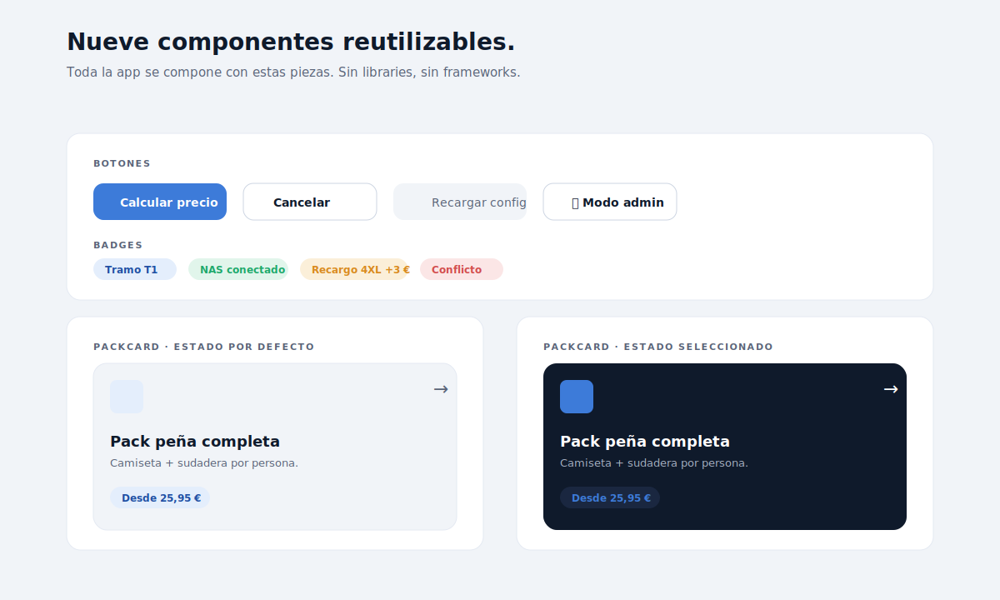

# Capítulo 06 · Sistema de diseño

> Una app interna no necesita marca, pero sí coherencia. PackPrice usa una paleta gris azulada de modo claro, dos tipografías especializadas (cuerpo + datos), once tokens semánticos y nueve componentes reutilizables. Todo en CSS plano, sin Tailwind, sin librería de componentes. Este capítulo desglosa cada decisión.



---

## Por qué un design system para tres pantallas

La pregunta es justa: PackPrice tiene cinco pantallas (bienvenida, selección, datos, resultado, modales). ¿Por qué armar tokens y componentes?

Por dos razones que compensan el coste:

1. **El proyecto va a vivir años**. Un cambio de paleta dentro de seis meses es trivial si los colores son tokens semánticos; es un grep-y-rezar si están hardcoded.
2. **Los componentes capturan decisiones**. Un `.btn-primary` no es solo un color: es un alto, un padding, un radius, un peso de fuente, un focus ring accesible. Cada vez que el código usa `.btn-primary`, esas seis decisiones se respetan automáticamente.

El coste son ~400 líneas de CSS extra. Para un proyecto que se queda en HTML/CSS/JS vanilla **sin build step**, eso son 30 KB que el navegador cachea una vez y olvida. Insignificante.

---

## La paleta

Once tokens semánticos cubren toda la app. **Semánticos** es la palabra clave: no se llaman `azul-1`, `gris-3`, sino `surface-secondary`, `accent-primary`, `fg-muted`. El nombre dice **para qué sirve**, no qué color es.

```css
:root {
  /* Superficies */
  --surface-primary:        #F1F4F8;  /* fondo página */
  --surface-secondary:      #FFFFFF;  /* tarjetas, modales */
  --surface-tertiary:       #F7F9FC;  /* footer modal, sutil */
  --surface-inverse:        #0F1A2B;  /* hero/precio en vivo */
  --surface-inverse-soft:   #1A2740;  /* badge sobre fondo oscuro */

  /* Foreground */
  --fg-primary:        #0F1A2B;
  --fg-secondary:      #5A6478;
  --fg-muted:          #8E97AB;
  --fg-inverse:        #FFFFFF;
  --fg-inverse-muted:  #A6B0C2;

  /* Bordes */
  --border-subtle:  #E4E9F2;
  --border-strong:  #CDD5E2;

  /* Acento */
  --accent-primary:        #3D7BD9;
  --accent-primary-hover:  #2E63B8;
  --accent-soft:           #E4EEFC;
  --accent-text-on-soft:   #1F4FA3;

  /* Estado */
  --success: #1FA86A;  --success-soft: #E1F5EB;
  --warning: #D98A1F;  --warning-soft: #FBEFD9;
  --danger:  #D24D4D;  --danger-soft:  #FBE6E6;
}
```

**Decisiones detrás de los colores**:

- **Modo claro fijo**. La app se usa en un taller con luz natural variable. El modo oscuro sería un capricho, no una necesidad. La paleta clara mejora legibilidad bajo cualquier luz.
- **Azul `#3D7BD9` como acento**. Cumple AA de contraste (4.85:1) sobre blanco para texto 14+. Perceptiblemente "técnico" sin ser corporativo agresivo.
- **`surface-inverse #0F1A2B`** para el hero del precio en vivo y el resultado. El contraste fuerte ancla la atención en el dato más importante.
- **`success` para el margen y `warning` para los recargos**. La semántica de color refuerza la lectura sin necesidad de iconos extra.

---

## La tipografía

Dos familias, distintas para distintos usos:

- **Inter** (Regular/600/700) — cuerpo, títulos, labels. Sans humanista con métricas optimizadas para pantallas. Legible a 12 px, perfecta a 14-16 px.
- **Geist Mono** (Regular/500/700) — datos numéricos. Precios, totales, tramos, IVA. Monoespaciada, glifos de número de ancho fijo (alineación visual perfecta en columnas), peso visual claramente diferenciado del cuerpo.

**Por qué dos fuentes y no una sola**: PackPrice es una app de números. El precio grande del hero (48-80 px) es el dato que el usuario lee primero. Tenerlo en monoespaciada hace que cuando cambia de "311,40 €" a "319,40 €" el cambio sea visualmente obvio: ningún glifo se desplaza horizontalmente. Con sans variable, los anchos cambiarían y el ojo perdería referencia.

**Empaquetado** vs. system fallback — la app empaqueta Inter y Geist Mono como `.woff2` en `renderer/fonts/` con `@font-face`. Suma ~150 KB al `.exe`. Sin conexión a internet, sin Google Fonts, todo offline. La diferencia visual con `system-ui + ui-monospace` es notable, sobre todo en los números.

---

## Los nueve componentes



PackPrice define exactamente **nueve componentes reutilizables** mapeados desde el archivo Pencil. Cada uno tiene una clase CSS y se compone con HTML semántico:

| Componente | Clase | Propósito |
|---|---|---|
| Button Primary | `.btn-primary` | CTA principal: "Calcular precio", "Guardar en NAS" |
| Button Secondary | `.btn-secondary` | Acciones secundarias: "Cancelar", "Modo admin" |
| Button Ghost | `.btn-ghost` | Acciones terciarias en topbar: "Recargar", "Ajustes" |
| Input field | `.field` | Wrapper label + input + hint |
| NumberStep | `.numstep` | Selector `− [valor] +` para cantidades |
| Badge | `.badge` | Pills informativas: "Tramo T1", "Recargo 4XL" |
| PackCard | `.pack-card` | Tarjeta clicable de selección de pack |
| Tabs | `.tabs` | Navegación interna del modal admin |
| StatTile | `.stat-tile` | Tile de métrica grande: "12 packs", "2h 12min" |

Y otros bloques compuestos que no son "components" en el Pencil pero se reutilizan:

- `.app-shell` — viewport con grid `topbar / body / footer`.
- `.split` — bienvenida en dos columnas (560 px + flexible).
- `.section-card` — radius 16, padding 24-32, stroke sutil.
- `.dark-card` — variante con `surface-inverse` + `fg-inverse` para hero.
- `.kicker` — badge pequeña encima de un H1.

---

## La PackCard: cuatro estados

La pieza más visible del sistema. Cada `.pack-card` tiene cuatro estados:

1. **Default** — fondo blanco, stroke sutil, contenido en `fg-primary`.
2. **Hover** — sombra leve, ligero `transform: translateY(-1px)`, transición 150 ms.
3. **Selected** — variante dark-card: fondo `surface-inverse`, texto `fg-inverse`, badge sobre `surface-inverse-soft`. Ese cambio fuerte de contraste comunica selección sin usar texto extra.
4. **Disabled** — opacidad 55 %, stroke discontinuo, badge "En desarrollo". Se usa para el "Pack personalizado" que aún no está implementado.

```html
<button class="pack-card is-selected" data-pack-id="pena_completa">
  <span class="pack-card__icon">📦</span>
  <span class="pack-card__arrow">→</span>
  <span class="pack-card__title">Pack peña completa</span>
  <span class="pack-card__desc">Camiseta + sudadera por persona.</span>
  <span class="badge badge--accent">Desde 25,95 €</span>
</button>
```

Es un `<button>`, no un `<div>`. **Accesibilidad por defecto**: foco con teclado, activación con Enter/Espacio, lectura por screen reader como elemento interactivo.

---

## Iconografía

Decisión deliberada: **emojis en la mayoría de sitios, SVG inline solo en hero/cards de pack**.

- Emojis funcionan offline, no exigen empaquetar fuentes ni librería de iconos, son universales en Windows.
- SVG inline solo donde el carácter visual es relevante (icono de pack en la PackCard, iconos del hero result).

Lo que **no** se hace: incluir Font Awesome, Heroicons, Lucide. Una librería entera para 8-10 iconos sería peso muerto, y la app valora más el carácter "interno y simple" que la perfección visual de cada glifo.

---

## Sombras, radios y espaciado

Cuatro radios cubren todo:

```css
--radius-sm:    8px;
--radius-md:   12px;
--radius-lg:   16px;
--radius-xl:   20px;
--radius-pill: 9999px;
```

Dos sombras:

```css
--shadow-card:  0 8px 32px rgba(15, 26, 43, 0.08);
--shadow-modal: 0 24px 64px rgba(15, 26, 43, 0.20);
```

El espaciado sigue una escala de 4 (4, 8, 12, 16, 24, 32, 48, 64). No hay tokens explícitos para spacing porque el patrón es lo bastante simple como para que el ojo lo regule sin necesidad de CSS variables.

---

## Animaciones: las justas

PackPrice no usa Framer Motion ni librerías de animación. Solo:

```css
transition: background-color 0.15s, border-color 0.15s, transform 0.05s;
```

Hover states de botones y cards. Sin más. Las animaciones largas en una calculadora interna solo añaden latencia percibida; ningún usuario del taller las pidió.

---

## Responsive

PackPrice se diseñó **desktop-first** porque ese es su contexto real. Breakpoints:

| Breakpoint | Ancho | Comportamiento |
|---|---|---|
| Default | ≥1280 | Layout completo del Pencil |
| Laptop estrecha | 1024–1279 | El sideCol del precio en vivo baja debajo del mainCol |
| Tablet | 768–1023 | PackGrid 2 cols; modal admin reduce ancho |
| Tablet pequeña | 600–767 | Topbar wrappea; resultado en 1 col |
| Mobile | <600 | Tres pantallas dedicadas (M1/M2/M3) |

En mobile las pantallas no son rutas separadas: el mismo HTML responde a media queries. Eso mantiene el código simple — un solo árbol DOM, las mismas IDs, las mismas funciones de cálculo.

---

## Decisiones bloqueadas en este capítulo

- **Tokens semánticos, no nombres de color**. Un token dice para qué sirve, no qué color es.
- **Modo claro fijo**. No hay modo oscuro hasta que un usuario lo pida con razones.
- **Inter + Geist Mono empaquetadas**. Sin Google Fonts, sin red, sin fallback al sistema en producción.
- **Nueve componentes reutilizables**, mapeados desde el archivo Pencil. Cualquier componente nuevo se debate y se documenta antes.
- **Emojis para iconografía general, SVG inline para hero**. Sin librerías de iconos.
- **Animaciones mínimas** (150 ms en hover). Sin Motion, sin librerías de animación.
- **Desktop-first**. Mobile es un override responsive, no un layout aparte.

---

⬅ [Capítulo 05](../05-config-js-y-persistencia/README.md) · ➡ [Capítulo 07 · Pantalla de bienvenida](../07-pantalla-de-bienvenida/README.md)
