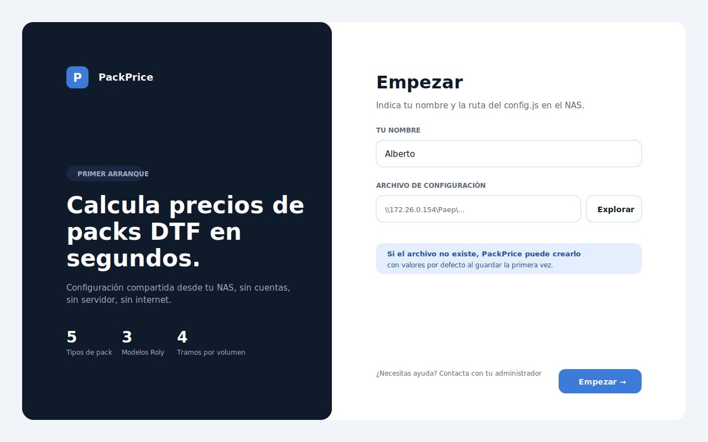

# Capítulo 07 · Pantalla de bienvenida

> El primer arranque es el único momento en el que la app pide algo. Después no vuelve a interrumpir. Esta pantalla resuelve onboarding sin login, sin email, sin contraseña: dos campos, un botón. Pero su composición visual también marca el tono de toda la app.



---

## Cuándo aparece

La pantalla de bienvenida se muestra **solo si no existe `%APPDATA%\packprice\settings.json`**. Es decir:

- Primer arranque de PackPrice en un PC nuevo.
- Si alguien borró manualmente el `settings.json` (intencionado o por accidente).
- Si la carpeta `%APPDATA%\packprice\` se perdió por reinstalación de Windows.

En los tres casos, el flujo es idéntico: pide nombre, pide ruta, valida, guarda, arranca la calculadora.

---

## El split layout

El diseño es **dos columnas**:

- **Izquierda 560 px** — fondo `surface-inverse` (`#0F1A2B`), color `fg-inverse`. Brand arriba, hero al centro, stats abajo. Es el "caparazón" visual de la marca.
- **Derecha flexible** — fondo `surface-secondary` (`#FFFFFF`). Form de dos campos + hint informativo + footer con CTA.

Bajo 900 px de ancho colapsa a una sola columna: el panel oscuro pasa a ser un banner reducido encima del formulario.

**Por qué split y no centrado** — un formulario centrado en una pantalla en blanco transmite "trámite". El split con hero oscuro a la izquierda transmite **"esto es una herramienta, no un trámite"**. Es la misma cantidad de píxeles pero distinta percepción de profesionalismo.

Y hay otra razón pragmática: el panel oscuro reutiliza la `dark-card` que aparece después en el preview en vivo y en el hero del resultado. Quien arranca la app por primera vez ya empieza a familiarizarse con el patrón visual que verá una y otra vez.

---

## Los dos campos

```html
<form class="form-stack">
  <div class="field">
    <label for="bv-nombre">Tu nombre</label>
    <input id="bv-nombre" type="text" placeholder="Alberto" required>
  </div>

  <div class="field">
    <label for="bv-config">Archivo de configuración</label>
    <div class="field-row">
      <input id="bv-config" type="text" readonly placeholder="\\172.26.0.154\Paep\Packs\config.js">
      <button type="button" id="btn-bv-explorar" class="btn-secondary">Explorar</button>
    </div>
  </div>

  <p class="hint hint--info">
    Si el archivo no existe, PackPrice puede crearlo con valores por defecto al guardar la primera vez.
  </p>
</form>
```

### Tu nombre

Texto libre. Se valida que no esté vacío. El nombre acaba en dos sitios:

- `settings.json:usuario` — local por PC.
- `config.js:modificado_por` — cada vez que alguien guarda en modo admin.

No es identificador único. Si Fede pone "fede" un día y "Fede" otro, son dos modificadores distintos en el rastro. Se asume que los usuarios escriben su nombre con consistencia razonable.

### Archivo de configuración

Es un input **readonly**. El usuario no escribe la ruta a mano: pulsa "Explorar" y abre un **diálogo nativo de Windows** (`dialog.showOpenDialog` desde `main.js` vía IPC). El diálogo filtra por archivos `.js`.

Cuando el usuario selecciona un archivo, la app:

1. Intenta leerlo con `leerConfigDesdeArchivo` (sandbox `vm`, timeout 1 s).
2. Si la lectura falla → mostrar error: "Este archivo no parece un config válido. ¿Quieres usarlo como base y crear uno nuevo?"
3. Si la lectura tiene éxito → muestra check verde y habilita el botón "Empezar".

**Caso especial: el archivo no existe**. Si el usuario navega a una carpeta del NAS y elige un nombre nuevo (`config.js` que aún no está), la app detecta `ENOENT` y ofrece **crear el config con valores por defecto** desde `config.default.js`. Eso facilita el primer arranque del primer usuario sin necesidad de que un developer le suba un archivo prefabricado.

---

## El hero del panel oscuro

Tres partes:

### Brand

```
┌──┐
│ P│  PackPrice
└──┘
```

Icono cuadrado con la inicial, color `accent-primary`. Tipo Inter Semibold a 18 px.

### Hero

Badge encima ("PRIMER ARRANQUE" sobre `surface-inverse-soft`), H1 a 42 px ("Calcula precios de packs DTF en segundos."), subtítulo a 15 px ("Configuración compartida desde tu NAS, sin cuentas, sin servidor, sin internet.").

El H1 es deliberadamente concreto: dice qué hace la app, no qué la hace única. Un eslogan vago aquí ("La forma más fácil de calcular precios") sería ruido. El usuario del taller no necesita ser convencido; necesita saber qué tiene delante.

### Hero stats

Tres stats en fila:

- **5** Tipos de pack
- **3** Modelos Roly
- **4** Tramos por volumen

No son métricas de uso, son **escala del modelo**. Comunican al usuario nuevo "esto cubre cinco modalidades, tres prendas y cuatro tramos" antes de que abra la calculadora. Reduce ansiedad de "¿lo que necesito está aquí?".

---

## El footer del formulario

Una línea con dos elementos:

```
¿Necesitas ayuda? Contacta con tu administrador          [ Empezar → ]
```

El texto de la izquierda es un enlace sutil (`fg-muted`, 12 px). En la práctica de un taller de dos usuarios, "tu administrador" es la persona que montó el NAS. Útil más como reconocimiento que como acción.

El botón de la derecha es `btn-primary` con flecha. Inhabilitado hasta que ambos campos sean válidos.

---

## Validación y feedback

El feedback de validación es **inmediato pero no agresivo**:

- Mientras el usuario escribe el nombre, no se valida.
- Al perder foco (`blur`), si el campo está vacío, aparece hint rojo bajo el input: "Este campo es obligatorio".
- Mientras el usuario no ha seleccionado config, el campo de ruta muestra el placeholder con la ruta UNC esperada como ejemplo.
- El botón "Empezar" está disabled hasta que ambos campos pasan validación.

No hay toasts, no hay alerts, no hay modales de error en esta pantalla. La fricción es lo que se quiere minimizar.

---

## Persistencia tras el primer "Empezar"

Cuando el usuario pulsa "Empezar":

1. Se valida nuevamente que el config se puede leer.
2. Se llama `await window.packprice.settingsWrite({ usuario, config_path })`.
3. `main.js` escribe `%APPDATA%\packprice\settings.json`.
4. Se oculta `#pantalla-bienvenida`, se muestra `#pantalla-seleccion-pack`.
5. La app entra en su flujo normal.

**Si la escritura del settings falla** (permisos en `%APPDATA%`, disco lleno), aparece el diálogo nativo de error y el usuario se queda en la bienvenida. No hay estado intermedio.

---

## Lo que no hace esta pantalla

Por contraste, vale la pena listar lo que **no se pide**:

- **No hay email**. La app no manda nada a nadie.
- **No hay contraseña**. La autenticación no es real (ver §10 de `CLAUDE.md`); la clave admin se introduce solo cuando se entra al modo admin.
- **No hay términos de servicio**. Es interna, propiedad del taller, no se aceptan condiciones.
- **No hay onboarding tour**. La app es lo bastante simple como para que un tour estorbe más que ayude. Los packs hablan solos.

Cada cosa que **no** se pide reduce fricción y ahorra mantenimiento.

---

## Decisiones bloqueadas en este capítulo

- **Solo dos campos**: nombre y ruta. Cualquier campo adicional se debate antes.
- **Diálogo nativo Windows para elegir el config**, no input de texto editable.
- **Permitir crear el config con defaults** si el archivo seleccionado no existe.
- **Sin email, sin contraseña, sin tour, sin términos**. Onboarding cero.
- **Bienvenida solo aparece si falta `settings.json`**. Si existe pero está corrupto, error explícito; nunca se borra automáticamente.

---

⬅ [Capítulo 06](../06-sistema-de-diseno/README.md) · ➡ [Capítulo 08 · Flujo principal](../08-flujo-principal/README.md)
