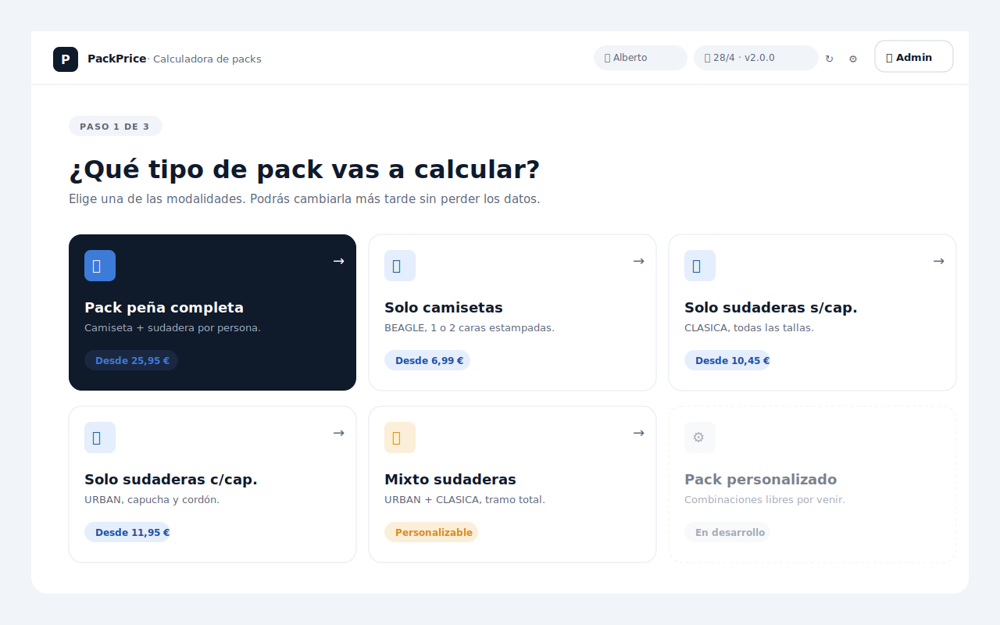
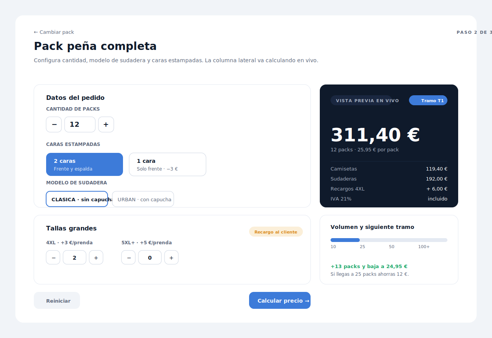
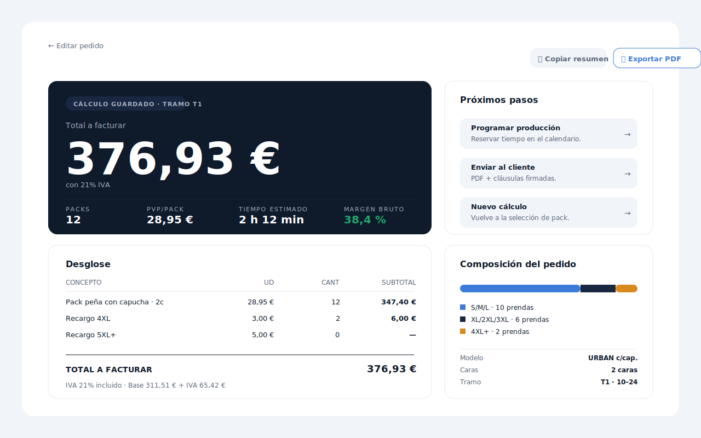

# Capítulo 08 · Flujo principal

> Tres pantallas, dos clics. Es el ciclo completo de PackPrice: elegir pack, configurar el pedido, ver el resultado. Todo lo demás (modo admin, ajustes, ayuda) son ramas. Este capítulo recorre cada pantalla con sus elecciones de UX y sus engranajes técnicos.

---

## Paso 1 · Selección de pack



La primera pantalla del flujo principal es una **rejilla de cinco PackCards** sobre un fondo neutro. El pack peña aparece **preseleccionado** (variante `dark-card`) porque es el más usado: ahorra un clic en el 70 % de los pedidos.

Encima del grid:

- **Breadcrumb "PASO 1 DE 3"** en chip ghost. Comunica progreso sin imponer un wizard agresivo.
- **H1 "¿Qué tipo de pack vas a calcular?"**. Pregunta directa, en español del dominio.
- **Subtitle** explicando que la elección no es definitiva: "Podrás cambiarla más tarde sin perder los datos."

### Las cinco cards

| Card | Estado | Descripción |
|---|---|---|
| Pack peña completa | Preseleccionado | Camiseta + sudadera por persona |
| Solo camisetas | Default | BEAGLE, 1 o 2 caras |
| Solo sudaderas s/cap. | Default | CLASICA |
| Solo sudaderas c/cap. | Default | URBAN |
| Mixto sudaderas | Default | URBAN + CLASICA con tramo total |
| Pack personalizado | Disabled | "En desarrollo" |

La card disabled no es un placeholder cosmético: es una **promesa de roadmap visible**. Comunica "esto va a existir" sin obligar al usuario a recordar dónde lo dijimos.

### El badge "Desde X €"

Cada card muestra el PVP **mínimo** (T4) en un badge `accent-soft`. Es un anclaje deliberadamente conservador: "Desde 22,95 €" es el suelo, no la oferta. Cuando el usuario configure el pedido y vea el T1, el precio será mayor pero ya está mentalmente preparado.

---

## Paso 2 · Datos del pedido



Aquí está la pieza más rica de la app, y la más densa técnicamente. Layout en dos columnas:

### Columna principal (formulario)

Tres section-cards apiladas:

1. **Cantidad** — `NumberStep` con botones `−` / valor mono / `+`. Validación: mínimo 10. El valor se introduce con teclado o flechas.
2. **Caras estampadas** — dos radio-cards grandes: "2 caras" (frente y espalda) o "1 cara" (solo frente, con la nota "−3 €" para anclar el ahorro).
3. **Modelo de sudadera** (solo en pack peña) — dos radio-buttons grandes: CLASICA (sin capucha) o URBAN (con capucha).
4. **Tallas grandes** — dos `NumberStep` para 4XL y 5XL+, con badge warning "Recargo al cliente" arriba a la derecha.

Acciones al pie:

- Botón ghost "Reiniciar" — vuelve a valores por defecto.
- Botón primary "Calcular precio →" — confirma el cálculo y avanza al paso 3.

### Columna lateral · Preview en vivo

Es el componente que distingue a PackPrice de una calculadora estática. **Mientras el usuario rellena el formulario**, la dark-card de la derecha **recalcula con cada `input` event** (debounce 50 ms) y muestra:

- Badge del tramo actual (T1, T2, T3, T4) en `accent-primary`.
- Total grande en Geist Mono (48 px).
- Línea descriptiva: "12 packs · 25,95 € por pack".
- Desglose: Camisetas, Sudaderas, Recargos 4XL, IVA 21%.

Debajo, una **section-card** con barra de tramos y una pista verde:

> "+13 packs y baja a 24,95 €. Si llegas a 25 packs ahorras 12 €."

Esa pista no es decorativa: es **comercial**. Cuando un cliente está pidiendo 22 packs, ver que con 25 baja el PVP es un argumento natural para subir el pedido. La calculadora se vuelve también herramienta de venta.

### Por qué preview en vivo y no solo "Calcular"

La V1 web usaba un único botón "Calcular". El usuario rellenaba todo, pulsaba, veía el resultado. Era simple pero poco informativo: cuando el resultado no convencía, el usuario tenía que volver atrás, cambiar un campo, calcular de nuevo, comparar.

El preview en vivo invierte el flujo: el usuario **explora**. Sube la cantidad, ve el tramo cambiar de T1 a T2, ve el total moverse. Es la diferencia entre "calcular" y "tantear".

Técnicamente: `calculo.js` exporta `calcularPreview(packId, inputs, cfg)` que devuelve `{ pvp, total, tramo, deltaSiguienteTramo }`. La función es **pura**, no toca DOM. El renderer la llama en cada `input` event y rellena la dark-card.

---

## Paso 3 · Resultado



Cuando el usuario pulsa "Calcular precio →", la app transiciona al paso 3. El layout también es de dos columnas:

### Hero result (izquierda · 700 px)

`dark-card` con cuatro elementos verticales:

- **Kicker** ("CÁLCULO GUARDADO · TRAMO T1") sobre `surface-inverse-soft`.
- **Total grande** en Geist Mono 80 px ("376,93 €"). Es el dato más importante, ocupa el espacio más grande.
- **Footnote** ("con 21% IVA") en `fg-inverse-muted`.
- **Stat row** con cuatro métricas mono: Packs, PVP/pack, Tiempo estimado, Margen bruto.

El **margen bruto en `success`** es la pieza más sutil: es información para el taller, no para el cliente. Pero está visible. La razón: el usuario puede comprobar de un vistazo si el descuento que está pensando dar dejaría margen aceptable. Si el cliente pide 5 % de rebaja, el operador ve que el margen baja del 38 % al 33 % y decide si compensa.

### Próximos pasos (derecha · 380 px)

Tres acciones en filas con flecha:

1. **Programar producción** — reservar tiempo en calendario (V3).
2. **Enviar al cliente** — exportar PDF (V3).
3. **Nuevo cálculo** — vuelve al paso 1.

Hoy solo "Nuevo cálculo" es funcional. Las otras dos son visibles como **promesa de roadmap**, igual que el "Pack personalizado" disabled del paso 1.

### Desglose (abajo izquierda)

Tabla de 4 columnas: CONCEPTO · UD · CANT · SUBTOTAL. Filas para cada concepto facturable (pack base, recargo 4XL, recargo 5XL+) y línea final destacada "TOTAL A FACTURAR" con tipo más grande.

Bajo la tabla, una nota: "IVA 21% incluido · Base 311,51 € + IVA 65,42 €". Doble representación útil para el gestor.

### Composición del pedido (abajo derecha)

Section-card con:

- Barra apilada de tallas (S/M/L vs XL/2XL/3XL vs 4XL+) coloreada por categoría.
- Lista de meta: Modelo, Caras, Tramo.

Es información que el taller usa al **planificar producción**: saber cuántas tallas grandes hay en el pedido afecta la compra a Roly y el tiempo de stock.

---

## Acciones globales

En la cabecera de los pasos 2 y 3, dos chips siempre visibles:

- **📋 Copiar resumen** — copia al portapapeles un resumen en texto plano del pedido. Útil para pegar en WhatsApp o email cuando se cotiza informalmente con el cliente.
- **📤 Exportar PDF** — V3, hoy solo visible como promesa.

A la izquierda, link "← Editar pedido" / "← Cambiar pack" para retroceder un paso sin perder los datos.

---

## Estado entre pantallas

PackPrice no usa router. La transición entre pantallas se hace mostrando/ocultando secciones del mismo `index.html` con la clase `.hidden`:

```js
function mostrarPantalla(id) {
  document.querySelectorAll('.pantalla').forEach(el => el.classList.add('hidden'));
  document.getElementById(id).classList.remove('hidden');
}
```

El estado del pedido vive en un objeto plano en `app.js`:

```js
let estado = {
  pack_id: 'pena_completa',
  cantidad: 12,
  caras: 2,
  tipo_sudadera: 'CLASICA',
  recargo_4xl: 2,
  recargo_5xl: 0,
};
```

Cuando el usuario retrocede de paso 3 a paso 2, la app rellena los inputs desde `estado`. Cuando avanza, el estado se actualiza con el formulario. **No hay localStorage**: si el usuario cierra la app, se pierde el estado actual. Es deliberado: la beta no guarda presupuestos.

---

## Lo que pasa al pulsar "Calcular precio"

```
[click]
  └─→ leer todos los inputs del formulario
      └─→ validar (cantidad ≥ 10, caras ∈ {1,2}, modelo válido)
          └─→ calcularPackXxx(estado, CFG)  // función pura
              └─→ renderResultado(totales, contexto)
                  └─→ mostrarPantalla('pantalla-resultado')
```

Cinco pasos, todo síncrono, todo local. Sin red, sin IPC, sin promesa. La pantalla de resultado aparece en menos de 30 ms desde el click.

Esa latencia no es casual: es lo que justifica gastar 150 KB en empaquetar fuentes y montar tres pantallas en lugar de una sola "calculadora rápida". La velocidad **es** la feature.

---

## Decisiones bloqueadas en este capítulo

- **Pack peña preseleccionado** en el paso 1. Ahorra un clic en el caso mayoritario.
- **Preview en vivo** en la pantalla de datos: `calculo.js` se invoca en cada `input` event con debounce 50 ms.
- **Mostrar margen bruto** en el resultado, en color `success`. Es información para el operador, no para el cliente, pero se considera útil tenerla visible.
- **Composición de tallas** en el resultado, para planificación de producción.
- **Sin router**: transición por mostrar/ocultar secciones del mismo HTML.
- **Sin persistencia del estado**: cerrar la app borra el pedido en curso. Se reabrirá la decisión en V3 con histórico explícito.
- **Acciones de roadmap visibles como disabled** ("Pack personalizado", "Programar producción", "Exportar PDF"): comunican el plan sin prometer fechas.

---

⬅ [Capítulo 07](../07-pantalla-de-bienvenida/README.md) · ➡ [Capítulo 09 · Modo admin con detección de conflictos](../09-modo-admin-conflictos/README.md)
