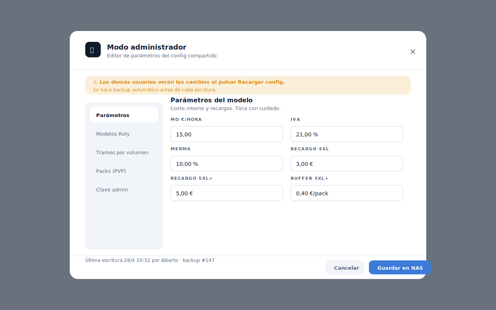
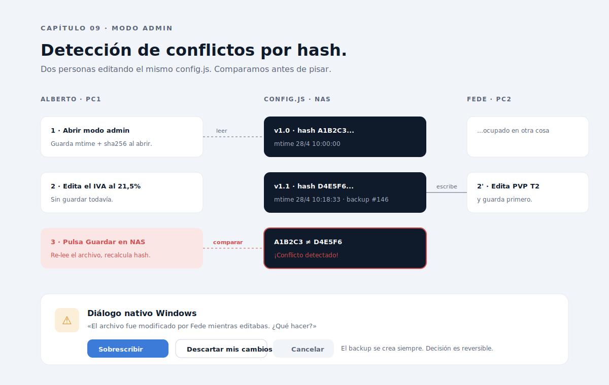

# Capítulo 09 · Modo admin con detección de conflictos

> El config compartido es de todos y de nadie. Cuando dos usuarios editan parámetros a la vez, alguien gana, alguien pierde. PackPrice nunca pierde silenciosamente: detecta el conflicto, hace backup automático y deja al usuario decidir. Este capítulo explica cómo.



---

## Qué hay detrás de la clave

El acceso al modo admin se protege con una **clave en texto plano** guardada en `config.admin.clave`. Vale la pena ser explícito sobre lo que esto es y lo que no es:

- **No es seguridad real**. Cualquier usuario con acceso de lectura al `config.js` la ve. Es **anti-clic-accidental**.
- **Sí es una barrera operativa suficiente**. Los dos usuarios reales del taller son técnicos y comerciales, no atacantes. El riesgo es que alguien toque parámetros sin querer, no que alguien malicioso edite el config.
- **Se valida en main.js, no solo en renderer**. Si la validación viviera solo en el renderer, sería trivial saltarla con DevTools. El handler IPC `config:write` re-valida la clave antes de escribir.

Si el día de mañana se necesita seguridad real, las opciones son: (1) hashear la clave con bcrypt y validarla en main, (2) firmar las escrituras con una clave pública por usuario. Hoy no hay justificación.

---

## Por qué hay conflictos en absoluto

Dos personas, un archivo. Si Alberto abre el modo admin para subir el IVA al 21,5 %, y Fede a la vez sube el PVP de los packs T2, lo que pase depende del orden de guardado:

- Si Alberto guarda primero, Fede sobrescribe sin enterarse.
- Si Fede guarda primero, Alberto sobrescribe sin enterarse.

En ambos casos, el último cambio pisa al penúltimo. El que pierde **no sabe que ha perdido**. Eso es lo que PackPrice impide.

---

## El mecanismo: `mtime + sha256`



El algoritmo es:

### 1. Al abrir el modo admin

```js
const archivo = await fs.promises.readFile(configPath);
const mtime  = (await fs.promises.stat(configPath)).mtimeMs;
const sha    = crypto.createHash('sha256').update(archivo).digest('hex');
estadoAdmin = { mtime, sha };  // se guarda en memoria del proceso main
```

### 2. Mientras el usuario edita

El renderer modifica un objeto local `cfgEditando`. **Nada se escribe** en disco hasta que pulse "Guardar en NAS".

### 3. Al pulsar "Guardar en NAS"

```js
const archivoActual = await fs.promises.readFile(configPath);
const mtimeActual = (await fs.promises.stat(configPath)).mtimeMs;
const shaActual = crypto.createHash('sha256').update(archivoActual).digest('hex');

if (shaActual !== estadoAdmin.sha) {
  // Conflicto detectado
  const decision = await mostrarDialogoConflicto({
    quienModifico: leerCfgRaw(archivoActual).modificado_por,
    cuandoModifico: new Date(mtimeActual).toLocaleString('es-ES'),
  });

  if (decision === 'sobrescribir')      proceder();
  else if (decision === 'descartar')   recargar();
  else                                  cancelarYDevolverEditor();
} else {
  await crearBackup(configPath);
  await escribirConfig(cfgEditando);
}
```

**Por qué `sha256` y no solo `mtime`** — el `mtime` cambia incluso si el contenido no cambia (por ejemplo, copia con `cp -p` en algunos filesystems). El hash garantiza que detectamos cambios reales de contenido. Combinar ambos da robustez: `mtime` es rápido, `sha256` es exacto.

---

## El diálogo de conflicto

Cuando el sha cambia, aparece un **diálogo nativo de Windows** (no un modal HTML) con tres opciones:

| Opción                    | Efecto                                                                                                 |
| ------------------------- | ------------------------------------------------------------------------------------------------------ |
| **Sobrescribir**          | Mis cambios ganan. El backup ya se creó, la versión anterior está recuperable.                         |
| **Descartar mis cambios** | La app recarga el config del NAS. Mis ediciones se pierden.                                            |
| **Cancelar**              | Vuelvo al editor admin con mis cambios pendientes. Puedo seguir editando o intentar guardar más tarde. |

El diálogo muestra **quién modificó** (lee `modificado_por` del archivo recién recargado) y **cuándo** (`mtime` formateado en español). Eso permite al usuario contextualizar la decisión: "ah, fue Fede a las 10:18, le voy a preguntar antes de pisar".

### Por qué diálogo nativo y no modal HTML

Tres razones:

1. **Se imita el patrón de Windows**. El usuario reconoce el patrón de `MessageBox` y entiende que es una decisión que el sistema necesita.
2. **Bloquea sin ambigüedad**. Un modal HTML puede tener bugs (foco perdido, click fuera, escape). El diálogo nativo es atómico.
3. **No requiere CSS adicional**. Es responsabilidad del SO; PackPrice no lo estiliza, no lo internacionaliza, no lo testea.

---

## Backups automáticos

Antes de **cualquier** escritura del config (haya conflicto o no), se crea un backup:

```js
async function crearBackup(configPath) {
  const dir = path.join(path.dirname(configPath), 'backups');
  await fs.promises.mkdir(dir, { recursive: true });
  const ts = new Date().toISOString().replace(/[:.]/g, '-');
  const dest = path.join(dir, `config-${ts}.js`);
  await fs.promises.copyFile(configPath, dest);
}
```

Tres detalles importantes:

- **Se crea siempre**. Incluso si el usuario elige "Sobrescribir" en el diálogo de conflicto: el backup contiene la versión antes-de-pisar de Fede.
- **No es bloqueante**. Si el backup falla (NAS lento, permisos puntuales), se loguea y la escritura del config continúa. Bloquear la escritura por un backup fallido sería peor que escribir sin backup en ese caso puntual.
- **No se purga automáticamente**. Cada backup pesa ~80 KB. Mil backups son 80 MB en el NAS. Coste irrelevante. Política sugerida: borrar manualmente backups > 90 días una vez al trimestre.

---

## El modal admin: anatomía

El modal admin es la pieza visual más densa de la app. Mide **920 px** de ancho, sombra fuerte, sobre overlay `surface-inverse` con 70 % de opacidad.

### Sidebar vertical (200 px)

Cinco entradas:

1. **Parámetros** — MO €/h, IVA, merma, recargos.
2. **Modelos Roly** — añadir/editar BEAGLE, CLASICA, URBAN.
3. **Tramos por volumen** — rangos y reducción.
4. **Packs (PVP)** — tabla 4×4 de PVP por tramo y por configuración.
5. **Clave admin** — cambiar la contraseña.

**Por qué sidebar vertical y no tabs horizontales** — con cinco pestañas largas ("Tramos por volumen") las tabs horizontales no caben sin truncar texto. Verticales escalan a más entradas sin sacrificar legibilidad.

### Banner de aviso

Justo bajo el header, banner amarillo `warning-soft` con icono triangle-alert:

> ⚠ Los demás usuarios verán los cambios al pulsar Recargar config. Se hace backup automático antes de cada escritura.

Es información que el operador necesita **antes** de tocar nada. Si lo lee y entiende, las consecuencias de cualquier cambio están claras. Si lo ignora, no es porque la app no lo dijera.

### Footer fijo

`surface-tertiary` con dos zonas:

- Izquierda: "Última escritura 28/4 10:32 por Alberto · backup #147". Información rápida sobre el estado del archivo.
- Derecha: botones "Cancelar cambios" (ghost) y "Guardar en NAS" (primary).

El footer es **fijo**: aunque el contenido del panel scrollee, los botones siempre están visibles. En un modal con muchos campos eso evita el clásico "scroll para encontrar el botón".

---

## Cuándo aparece el aviso aunque solo edite uno

El sha del archivo cambia incluso si solo escribe **el mismo usuario**, en escenarios como:

- Alguien editó el `config.js` a mano con notepad mientras el modal estaba abierto.
- El archivo se restauró desde un backup.
- El reloj del NAS saltó.

En todos esos casos, el diálogo aparece. **Es comportamiento esperado**: el usuario elige "Sobrescribir" y sigue. La alternativa (no detectar) sería peor: no avisar de un cambio real.

---

## Lo que PackPrice no implementa

A propósito, **no hay**:

- **Locks distribuidos**. SMB no soporta locks fiables, y la app es lo bastante poco crítica como para no necesitarlos. La detección de conflictos a posteriori es suficiente.
- **Edición colaborativa en tiempo real**. Esto no es Google Docs. Si dos personas necesitan editar a la vez, el diálogo de conflicto las obliga a coordinar.
- **Historial dentro de la app**. El historial está en `backups/` con timestamps. Acceder a él es manual: abrir el `.js` con notepad y leer.
- **Diff visual entre versiones**. Demasiado coste para un caso que ocurre con poca frecuencia.

---

## Decisiones bloqueadas en este capítulo

- **Detección de conflictos por `mtime + sha256`**, no por intentar bloquear el archivo con locks SMB.
- **Diálogo nativo Windows** para preguntar al usuario, no modal HTML.
- **Backup automático antes de cada escritura**, no opcional.
- **Backup no es bloqueante**: si falla, se loguea y la escritura continúa.
- **Sin purga automática de backups**. Operador la hace cada trimestre.
- **Clave admin en texto plano**. Es protección anti-clic-accidental, no seguridad real. Documentado.
- **Sin edición colaborativa real-time**. PackPrice es individual con detección a posteriori.

---

⬅ [Capítulo 08](../08-flujo-principal/README.md) · ➡ [Capítulo 10 · Empaquetado, distribución y futuro](../10-empaquetado-y-futuro/README.md)
