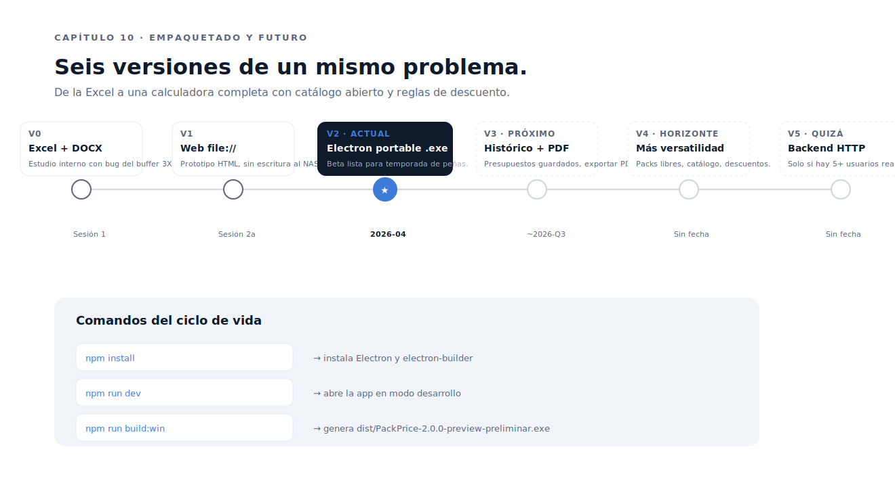

# Capítulo 10 · Empaquetado, distribución y futuro

> Una app que solo corre en `npm run dev` no existe para el taller. PackPrice empaqueta a un `.exe` portable Windows x64, sin instalador, sin firma, sin auto-update. Distribución manual: copia y ejecuta. Este capítulo documenta cómo se construye, cómo se distribuye y qué viene después.



---

## El comando que produce el `.exe`

```bash
npm install         # solo la primera vez
npm run dev         # iterar en local
npm run build:win   # generar el .exe
```

El último comando llama a `electron-builder --win --x64`, que lee la sección `build` de `package.json`:

```json
{
  "build": {
    "appId": "com.packprice.calculadora",
    "productName": "PackPrice",
    "directories": { "output": "dist" },
    "files": [
      "main.js",
      "preload.js",
      "config.default.js",
      "renderer/**/*",
      "icon.png",
      "package.json"
    ],
    "win": {
      "target": [{ "target": "portable", "arch": ["x64"] }],
      "icon": "icon.png"
    },
    "portable": {
      "artifactName": "PackPrice-${version}-preliminar.exe"
    }
  }
}
```

Resultado: `dist/PackPrice-2.0.0-preview-preliminar.exe`. Un solo archivo de ~85 MB que contiene Chromium, Node, el código de PackPrice, el icono y nada más. **Sin instalador**. Se ejecuta directamente con doble clic.

**Por qué portable y no installer**:

- Cero permisos de administrador. Funciona en cuentas restringidas.
- No deja rastro en Registro ni en `Program Files`. Si se borra el `.exe`, la app desaparece (los datos de `%APPDATA%` y NAS persisten, claro).
- Distribución por copia. Sin choreografías de instalación.

**Por qué `-preliminar` en el sufijo**: la versión actual es **beta**, no V1. El sufijo lo deja claro a cualquiera que reciba el archivo. Cuando la beta supere la validación operativa de varios pedidos reales, se eliminará el sufijo y se promocionará a V1.

---

## Distribución manual

Hoy son 2-3 PCs, así que la distribución es manual:

1. Construir en un PC: `npm run build:win`.
2. Copiar `dist/PackPrice-*.exe` a un USB o al NAS.
3. En cada PC del taller: copiar el `.exe` a `C:\Apps\PackPrice\` (carpeta convenida).
4. Doble clic. Windows SmartScreen avisa la primera vez (no hay firma digital). El usuario pulsa "Más información → Ejecutar de todas formas". Solo la primera vez por PC.

**Por qué no firma digital**: un certificado de code signing legítimo cuesta 200-400 €/año. Para una app interna de tres usuarios, no compensa. SmartScreen solo molesta una vez. El día que la app se distribuya fuera del taller, se replantea.

**Por qué no auto-update**: `electron-updater` requiere un servidor (GitHub Releases, S3, propio). Hoy no lo hay. Cuando se necesite, se monta. No antes.

---

## El versionado

Tres números importantes y cómo se relacionan:

- **`package.json:version`** — versión semver de la app: `2.0.0-preview` hoy.
- **`config.default.js:VERSION`** — versión del esquema del config. Coincide con la versión de la app que sembró el config.
- **`config.js` del NAS, campo `version`** — la última versión que escribió. Útil para detectar si toca migrar.

Cuando se cortes una release real:

1. Bumpa `package.json:version` y `config.default.js:VERSION` en el mismo commit.
2. Ejecuta `npm run build:win` desde ese commit.
3. Etiqueta el commit en git con el número de versión.

**Hoy estamos en beta**: el versionado usa sufijos pre-release (`-beta`, `-preview`) para no enviar la señal "estable" antes de que lo esté.

---

## Cero dependencias en runtime

Una propiedad que merece su párrafo. PackPrice tiene **dos dependencias** y ambas son `devDependencies`:

```json
{
  "devDependencies": {
    "electron": "^31.0.0",
    "electron-builder": "^24.13.0"
  }
}
```

**Cero dependencias de runtime**. Eso significa:

- El `npm audit` de mañana no genera trabajo. No hay paquetes transitivos que parchear porque no hay paquetes transitivos.
- El `node_modules/` final pesa lo que pesa Electron + electron-builder. Sin sorpresas.
- Cualquier nueva entrada en `dependencies` requiere justificación documentada (en commit + en `CLAUDE.md` §8.3).

Cuando hace falta algo (formateo de números, hash, lectura de archivos), se usa la **stdlib de Node** (`crypto`, `fs`, `vm`, `path`) o se escribe en JS plano. La librería más tentadora que el proyecto **rechazó** fue `lodash`. Toda la utilidad de cálculo cabe en cien líneas de código nativo.

---

## Audit y mantenimiento

Antes de cada release de aquí en adelante:

```bash
npm audit                  # vulnerabilidades de transitivas
npm outdated               # actualizaciones disponibles
npm run dev                # smoke test funcional
npm run build:win          # build limpia
```

Con cero deps de runtime, las vulnerabilidades suelen ser de transitivas de build (`electron-builder`). Para una app interna sin red, son tolerables; documentar las que se ignoran y por qué.

`electron` y `electron-builder` se actualizan **con cuidado**, probando empaquetado después de cada bump. Un major de Electron puede romper APIs sutiles (cambios en `BrowserWindow`, en seguridad de IPC).

---

## El roadmap

### V0 — Excel + DOCX (entregado)

Sesión 1. Estudio interno completo con costes, márgenes, escenarios, riesgos. Calculadora Excel con el bug del buffer 3XL que la V2 corrige. Sirvió como **fuente de la verdad de negocio** mientras se modelaba la app.

### V1 — Web `file://` (entregada como prototipo)

App HTML/JS abierta con doble clic. Funcionaba pero exigía descargar el config modificado y subirlo al NAS a mano. **Sirvió como referencia visual y de lógica**: la V2 reutiliza todo su código.

### V2 — Electron `.exe` (versión actual, en beta)

App de escritorio empaquetada como `.exe` portable. Lee y escribe directamente el `config.js` del NAS, modo admin con detección de conflictos, backups automáticos, identificación de usuario.

**En fase de pruebas locales** antes de distribución a otros PCs. Beta declarada hasta que pase un par de pedidos reales sin sorpresas. La meta de la beta es muy concreta: **estar lista para la temporada de peñas**, que es cuando el taller vende mejor y donde el descuento por volumen tiene más impacto. Lo que entra en V2 es lo justo para presupuestar bien en julio.

### V3 — Persistencia y exportación (próximo)

Cuando V2 se asiente, V3 introducirá:

- **Histórico local de presupuestos** en `localStorage` o JSON local por PC. NO en el NAS — el config compartido es solo configuración, no histórico.
- **Exportación de presupuesto a PDF** con `webContents.printToPDF()` o `pdfkit`.
- **Datos del cliente** (peña, contacto, móvil) en cada presupuesto.
- **Búsqueda y reapertura** de presupuestos antiguos.

Estimación: una sesión de implementación una vez la beta pase la fase de pruebas.

### V4 — Más versatilidad para el cliente (en el horizonte)

V4 abre la calculadora más allá de los cinco packs cerrados de hoy. Es la versión donde la app empieza a parecerse a una herramienta de presupuestos completa, no solo de packs de peña:

- **Pack personalizado** funcional. Combinaciones libres de modelos, mezcla de tipos de prenda, número de caras independiente por modelo.
- **Catálogo de modelos Roly editable desde admin**, no solo BEAGLE/CLASICA/URBAN. Añadir polos, gorras, totebags y otros referencias sin tocar código.
- **Reglas de descuento configurables** por usuario admin: descuentos puntuales por cliente recurrente, promociones por temporada, cupones.
- **Variantes de PVP por canal**: web, presencial, distribuidor. El mismo cálculo, distintos márgenes.
- **Datos de tallaje agregados** para cerrar stock en Roly antes de confirmar precio en pedidos grandes.

V4 no tiene fecha. Llega cuando la operativa pida más versatilidad de la que V2/V3 ofrecen. La arquitectura actual (config plano, cálculo puro, IPC tipado) está pensada para que estas adiciones sean **incrementales**, no reescrituras.

### V5 — Centralización avanzada (quizá nunca)

Solo si se cruzan los **5 usuarios activos** o si llegan **3+ peticiones de reportes cross-PC**. Plan:

- Levantar Node + Express + SQLite en un PC siempre encendido del taller.
- Endpoints `GET /config`, `PUT /config`, `GET /presupuestos`, `POST /presupuestos`.
- La app Electron se vuelve cliente HTTP, el `config.js` deja de ser punto único.
- Auto-update vía GitHub Releases + `electron-updater`.

**No empezar V5** sin justificación cuantificable. La complejidad operativa que añade es real (servidor, BD, copias, monitorización).

---

## Riesgos y validaciones pendientes

Antes de promover la beta a V1, hay validaciones operativas que cubrir:

- **Cronometrar 3 pedidos reales**: medir tiempo medio por prenda. Si supera 5,5 min, ajustar `tiempo_2c_min` en config.
- **Registrar merma real** en 3 pedidos: si supera el 12 % sistemáticamente, subir el parámetro `merma_pct`.
- **Validar PVP de packs nuevos** (camisetas, CLASICA, URBAN, mixto). Hoy son provisionales. Confirmar con un par de presupuestos reales antes de comunicarlos en flyer o web.
- **Comprobar comportamiento del NAS bajo carga**: dos usuarios escribiendo a la vez, NAS lento, NAS desconectado. Verificar que los mensajes de error son claros.
- **Probar el conflicto admin** en producción: editar el `config.js` con notepad mientras un admin está abierto, comprobar que el diálogo aparece.

---

## Cosas que hay que vigilar

Tras la distribución:

- **El bug del buffer 3XL en la Excel V0** sigue ahí si la calculadora antigua se sigue usando. Decisión: cuando la V2 sea herramienta de uso diario, la Excel queda como referencia histórica únicamente.
- **El `.exe` no firmado** genera aviso de SmartScreen la primera vez en cada PC. Aceptado.
- **Cuando saquemos V3 con cambios de código**, hay que redistribuir el `.exe` manualmente. Si crece el número de usuarios, valorar añadir auto-update.
- **Los backups del NAS** se acumulan sin purga automática. Operador debería borrar > 90 días una vez al trimestre.
- **Copia de seguridad del config + backups** a un disco externo cada 6 meses, como protección frente a fallo del NAS.

---

## Decisiones bloqueadas en este capítulo

- **Build portable Windows x64, sin instalador**. No requiere permisos de admin, no toca Registro.
- **Sufijo `-preliminar` en el `.exe`** mientras la app esté en beta. Versión `2.0.0-preview` con sufijos pre-release.
- **Sin firma digital** hasta que haya distribución externa. SmartScreen aceptado la primera vez por PC.
- **Sin auto-update**. Distribución manual mientras sean ≤4 usuarios.
- **Cero dependencias de runtime**. Cualquier nueva entrada en `dependencies` requiere justificación.
- **Roadmap conservador**: V3 cuando la beta se asiente; V4 cuando haya pedido real de más versatilidad (packs libres, catálogo abierto, reglas de descuento); V5 solo si hay justificación cuantificable de centralización.
- **La beta entrega lo justo para la temporada de peñas**. Todo lo demás se aplaza. La urgencia de calendario marca el alcance, no las ganas.

---

## Cierre del devlog

Este es el último capítulo. Si has llegado hasta aquí, el modelo mental completo de PackPrice ya cabe en tu cabeza:

- Una app Electron de tres pantallas, sin frameworks, sin build step.
- Un `config.js` plano en el NAS como punto único de verdad.
- Detección de conflictos por hash, backups automáticos, diálogos nativos.
- Cinco packs comerciales, cuatro tramos por volumen, tres modelos Roly.
- Dos a tres usuarios, beta hoy, V1 cuando la operativa lo confirme.

La promesa que hacía el [README del devlog](../README.md) era que en seis meses nadie tuviera que preguntarse *por qué se hizo así*. Cada capítulo ha intentado responderlo. Si encuentras una decisión sin justificar al volver, **arregla el código o arregla este documento**. No dejes desviaciones silenciosas — son la entropía con la que mueren los proyectos pequeños.

Gracias por leer.

---

⬅ [Capítulo 09](../09-modo-admin-conflictos/README.md) · ⏮ [Volver al índice](../README.md)
