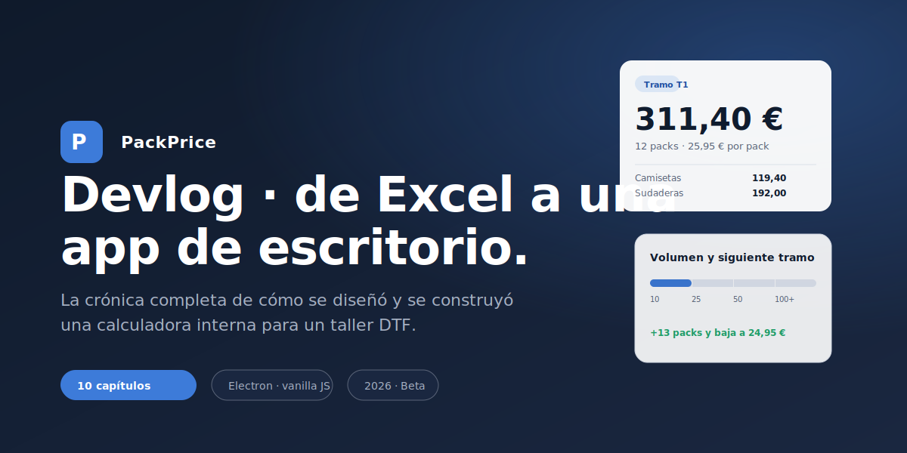

# PackPrice · Devlog

> Crónica completa de cómo se diseñó y se construyó **PackPrice**, una calculadora de precios de packs DTF para un taller de personalización textil de Guadalajara con más de 25 años en el sector. Una app de escritorio Electron, vanilla JavaScript, sin frameworks, sin servidor, sin nube. Construida con un objetivo de calendario muy concreto: que el taller pueda presupuestar bien la temporada de peñas que se acerca. Pensada para ampliarse después con más versatilidad para cliente y usuario.

---

## Por qué este devlog

Casi todo el software se documenta en pasado y en seco: un README con cuatro comandos, un changelog y, si hay suerte, una página de arquitectura. El proceso —las decisiones que se tomaron, las que se descartaron, los caminos que parecían buenos y no lo eran— se evapora.

Este devlog hace lo contrario. Cada capítulo es una parada del recorrido: contexto, problema, opciones, decisión y consecuencias. Si en seis meses alguien tiene que tocar PackPrice, no debería preguntarse *por qué se hizo así*. La respuesta está aquí.

También hace algo más útil para un equipo pequeño: **bloquea decisiones**. Una vez documentadas, debatirlas otra vez tiene un coste que se nota. Es la mejor forma que conozco de proteger una base de código pequeña de la entropía.

---

## Índice de capítulos

| #   | Capítulo                                                                              | Tema                                                                |
| --- | ------------------------------------------------------------------------------------- | ------------------------------------------------------------------- |
| 01  | [La idea y el contexto](01-genesis-y-contexto/README.md)                              | Un taller DTF de +25 años, una Excel con bug, dos usuarios.         |
| 02  | [El modelo de negocio](02-modelo-de-negocio/README.md)                                | Costes, márgenes, tramos por volumen y los cinco packs comerciales. |
| 03  | [Decisiones técnicas](03-decisiones-tecnicas/README.md)                               | Cinco caminos descartados antes de elegir Electron.                 |
| 04  | [Arquitectura Electron](04-arquitectura-electron/README.md)                           | Tres procesos, una frontera segura, IPC tipado por convención.      |
| 05  | [`config.js` y persistencia](05-config-js-y-persistencia/README.md)                   | Por qué un archivo plano en el NAS late mejor que SQLite.           |
| 06  | [Sistema de diseño](06-sistema-de-diseno/README.md)                                   | Tokens, paleta gris azulada, Inter + Geist Mono, nueve componentes. |
| 07  | [Pantalla de bienvenida](07-pantalla-de-bienvenida/README.md)                         | Split layout, hero oscuro y onboarding sin login.                   |
| 08  | [Flujo principal](08-flujo-principal/README.md)                                       | Selección de pack, datos del pedido con preview en vivo, resultado. |
| 09  | [Modo admin con detección de conflictos](09-modo-admin-conflictos/README.md)          | mtime + sha256, backups automáticos, diálogos nativos.              |
| 10  | [Empaquetado, distribución y futuro](10-empaquetado-y-futuro/README.md)               | electron-builder portable, roadmap V0→V5, ampliación con el tiempo. |

---

## Cómo leer este devlog

El orden está pensado para leerse de arriba abajo. Cada capítulo asume el anterior. Si vienes a buscar algo concreto, los apartados de cada capítulo son autocontenidos: hay un resumen ejecutivo de tres líneas al principio y un bloque de "decisiones bloqueadas" al final.

Si solo te interesan tres cosas:

- **Por qué Electron y no algo más simple** → [Capítulo 03](03-decisiones-tecnicas/README.md).
- **Cómo se evita pisar el config entre dos usuarios** → [Capítulo 09](09-modo-admin-conflictos/README.md).
- **Cómo se construye y distribuye el `.exe`** → [Capítulo 10](10-empaquetado-y-futuro/README.md).

---

## Stack en una frase

Electron + Node.js + Chromium + HTML/CSS/JS vanilla, sin build step, sin frameworks UI, sin TypeScript, con `config.js` plano en el NAS de la empresa como punto único de verdad.

Para el resto, [`CLAUDE.md`](../CLAUDE.md) tiene la versión normativa de las reglas y [`PLAN_Calculadora.md`](../PLAN_Calculadora.md) la versión completa del modelo de negocio.

---

*Devlog redactado al cierre del ciclo de diseño y entrega de la beta. Última revisión: 2026-04-30.*
